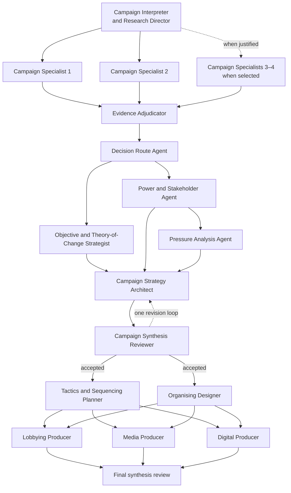

# ADR 0003: Use LangGraph for campaign orchestration

## Status

Accepted — 14 July 2026

## Context

The redesigned factory must run five campaigns concurrently, coordinate twelve to fifteen genuine agents per campaign, fan work out and back in, preserve partial results, stream visible activity, pause individual branches for human judgement, and progressively assemble each Campaign Brief Page.

The existing pipeline is a small sequential set of direct Anthropic calls kept alive by a serverless `after()` callback. It has durable campaign state but not durable task execution, nested agent state, campaign-level concurrency control, or the event model required by the Factory Gallery.

The Codex SDK is designed primarily for coding-focused Codex threads. The OpenAI Agents SDK supplies useful agent, hand-off, tracing, and approval primitives, but this campaign workflow principally needs an explicit, durable dependency graph while retaining its current Anthropic models.

## Decision

Use LangGraph JS as the orchestration layer for Campaign Factory Runs.

- Each campaign is a checkpointed graph with explicit agent nodes, parallel branches, fan-in, review loops, and resumable human interrupts.
- Campaign Brief sections retain their numbered reading order but may assemble and reach reviewer-accepted state out of order whenever real dependencies and parallel work permit. The Campaign Progress Rail reflects actual per-section state rather than forcing sequential completion.
- Five campaign graphs may execute concurrently under a batch-level concurrency limit.
- The prototype defaults to at most twenty-five active model calls across the batch. Ready graph nodes beyond that limit remain truthfully queued. The limit is environment-configurable for provider capacity and rehearsal tuning.
- LangGraph nodes initially call the existing Anthropic integration directly. The project will not adopt the broader LangChain agent abstraction stack unless a concrete node requires it.
- The application owns a provider- and framework-neutral Factory Event schema. LangGraph execution events are translated into Factory Events before reaching the interface or Campaign Build Record.
- Every Runtime Agent receives the Agent Collaboration Toolkit: `report_work`, `request_specialist`, `handoff_artifact`, `submit_proposal`, `raise_conflict`, `request_judgement`, and `complete_task`. These actions emit Factory Events and power the visible Work Backscroll; agent-specific source and production tools remain separately permissioned.
- Campaign and checkpoint state remain durable in Postgres.
- The Codex SDK is reserved for coding-focused work such as the separate dashboard-building reveal, not campaign research and strategy generation.

## Consequences

- Parallelism, resumability, partial failure, and human intervention become explicit graph behaviour instead of ad hoc promise coordination.
- The Factory Gallery can truthfully render nested work and hand-offs from durable events.
- The system gains a substantial framework migration and a new state model that must be tested under concurrent load.
- Retaining Anthropic avoids combining an orchestration rewrite with an immediate model-quality migration.
- Owning Factory Events prevents the product interface from becoming coupled to LangGraph terminology or raw debug output.

## Common campaign graph

Every campaign uses the following dependency spine. Campaign Specialists vary by campaign and additional registered specialists may be requested during execution, but the Campaign Output Contract and primary hand-offs remain stable.

The Campaign Synthesis Reviewer is one recurring campaign-scoped agent, not two separate agent identities. `RV1` and `RV2` show different turns by that same agent. It also reviews and closes Step Workspaces as their proposals become ready.

The numbered Campaign Brief remains ordered for reading, but accepted sections and Canonical Campaign Documents may materialise out of order as this graph progresses.

## Conference latency targets

These are experience targets for genuine work, not animation timers:

- render the Factory Gallery and five first Runtime Agents within 2 seconds of launch;
- show meaningful Work Backscroll within 10 seconds;
- surface the first sourced finding within 30–45 seconds;
- accept the first Campaign Brief section within 90 seconds;
- complete the first campaign within 8 minutes; and
- substantially complete the five-campaign batch within 12 minutes.

If campaigns remain active when the panel reaches its reveal point, the Batch Receipt presents an honest Factory snapshot rather than forcing or simulating completion.
