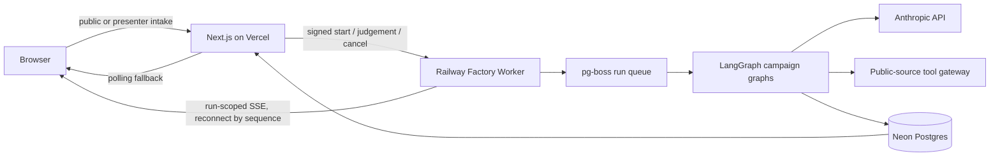

# Campaign Factory implementation parameters

**Status:** Recommended implementation defaults, 15 July 2026

**Scope:** Conference factory rewrite

**Applies to:** the public one-campaign experience, coded presenter batches, Factory Gallery, Campaign Assembly View, LangGraph runtime, Campaign Brief, nine documents, evidence, replay, and promotion

**Execution:** the delivery structure for the compressed parallel build is in [`factory-12-hour-build-plan.md`](factory-12-hour-build-plan.md); it applies this document's §1 scope guard and adds 12-hour-specific deferrals.

## Executive decision

Build the conference prototype as a real fifteen-agent campaign graph, not a simulation and not a general-purpose agent platform. Keep the existing light Awake-inspired Campaign Factory as the primary product. Lay a temporary, dense technical instrument over it while agents are working. The overlay may be visually intimidating; the campaign anchors, human decisions, evidence states, and finished brief must remain calm and legible.

Use one Vercel project with an isolated Pro `factory-dev` Custom Environment. Run open-source LangGraph JS in one always-on Railway worker using Postgres checkpoints and a Postgres-backed durable queue. Do not add Vercel Workflow, LangGraph Agent Server, Redis, LangSmith deployment, BYOK, persistent watchers, generic chat, Mission Bay, or OpenClaw to the Campaign Factory runtime.

The implementation target is twenty engineering days from start to conference-safe release: fifteen build days and five days of evaluation, rehearsal, freeze, and recovery preparation. The dates below are relative because the event date is not yet recorded in the repository.

## Parameter summary

| Area | Default |
|---|---|
| Delivery envelope | 15 build days plus 5 hardening days; one full-stack engineer and one product owner/reviewer |
| Runtime agents | 13 fixed responsibilities plus 2 automatically selected specialists by default; 15 soft target, 20 hard cap |
| Live batch | 1 public campaign or 1–5 presenter campaigns; 25 global model calls, 5 per campaign in presenter batches |
| Runtime | Railway Pro, one always-on Node worker, open-source LangGraph JS, `PostgresSaver`, `pg-boss`, isolated Neon branch |
| Models | Sonnet 5 for research, analysis, tactics, organising, and production; Opus 4.8 for strategy and major synthesis reviews; Haiku 4.5 for invisible QA only |
| Research | 2–4 specialist lanes; 20 web searches maximum per campaign; load-bearing claims require current public evidence |
| Cost | target p50 $2.50–$3.50 per campaign; hard $8 per campaign and $35 per five-campaign presenter batch |
| Experience | light Awake product; dark translucent technical overlay; every active agent gets a real card; at most 10 expanded cards at once |
| Demo fallback | manual switch to a permanently labelled replay; never splice replay events into a live run |
| Promotion | no production cutover until recovery, evidence, cost, batch, replay, rollback, and dress-rehearsal gates pass |

---

## 1. Deadline and team capacity

### Recommended delivery envelope

Plan backwards from `T0`, the conference:

| Window | Outcome |
|---|---|
| T-20 to T-18 working days | `factory-dev`, Neon branch, Railway worker skeleton, signed service boundary, versioned migrations |
| T-17 to T-15 | Factory Event schema, accepted campaign state, proposals, evidence, agent contracts, replay contract |
| T-14 to T-10 | LangGraph, fixed backbone, specialist selection, concurrency gate, checkpoint recovery, failure semantics |
| T-9 to T-6 | Public Campaign Assembly View, presenter batch intake, Factory Gallery, Agent Work Cards, receipts |
| T-5 to T-4 | Campaign Brief assembly, nine documents, Judgement Requests, Evidence and Next Checks, exports |
| T-3 | Five-campaign load test, worker restart test, cost measurement, first full dress rehearsal |
| T-2 | Feature freeze, fix only blocker defects, run and promote the labelled replay batch |
| T-1 | Presenter and backup-device rehearsal; no schema, model, graph, or animation changes |
| T0 | No deployment. Use the rehearsed live route and replay fallback |

This is a twenty-day delivery envelope, not a claim that twenty elapsed days are always required. It is the safe amount of focused work for one full-stack engineer with daily product review. If two engineers work in parallel, preserve the five-day hardening tail rather than using it for more features.

### Conference P0

The following must exist before the factory can be shown as real:

- isolated `factory-dev` deployment, database, worker, secrets, and spending controls;
- public one-campaign assembly and coded presenter batches of up to five;
- 13 fixed Runtime Agent responsibilities and two real campaign-selected specialists;
- durable execution, Factory Events, checkpoint recovery, visible failure, and partial completion;
- real Agent Work Cards, hand-offs, reviewer passes, Campaign Completion Receipts, and Batch Receipt;
- progressive ten-step Campaign Brief, nine Canonical Campaign Documents, and Evidence and Next Checks;
- the recurring Campaign Synthesis Reviewer and one bounded revision loop;
- conditional nonblocking Judgement Requests with Provisional Defaults;
- immutable real-run replay at `/factory/replay/conference`;
- measured cost, latency, and five-campaign rehearsal results.

### Scope guard

If fewer than fifteen build days remain, do not make agents decorative and do not weaken evidence controls. Cut in this order:

1. rich targeted-rebuild diff UI, while retaining versioned state and a basic rerun action;
2. specialist escalation beyond the two specialists selected at intake;
3. nonessential export formats beyond HTML, copy, and one downloadable format;
4. historical Work Trace filtering beyond the collapsed Step Build Receipt;
5. production promotion, using the stable `factory-dev` presenter URL for the conference instead.

Do not cut the real graph, source provenance, visible failure, replay label, human approval boundary, public single-campaign experience, or presenter batch.

---

## 2. Exact agent contracts

### Roster rule

Every campaign starts with thirteen fixed responsibilities and normally two specialists. A third or fourth specialist is allowed only when the scoping output identifies a distinct institution, evidence system, or policy domain that the selected pair cannot cover. The default run therefore contains fifteen Runtime Agent identities; seventeen is normal but less common; twenty is the hard stop.

One Runtime Agent means one independently invoked model process with a named contract, its own agent-run ID, a structured result or review, and observable Factory Events. Deterministic validators, reducers, schedulers, and document compilers are never shown as agents.

### Common input and output

Every agent receives a bounded `AgentTaskEnvelope`:

```ts
interface AgentTaskEnvelope {
  batchId?: string;
  campaignId: string;
  agentRunId: string;
  parentAgentRunId?: string;
  stateVersion: number;
  journeySteps: number[];
  task: string;
  contextRefs: string[];
  evidenceRefs: string[];
  constraints: string[];
  toolPolicy: string;
  deadlineAt: string;
}
```

Every agent returns a typed result containing:

- a concise public work summary;
- claims or decisions with evidence references;
- explicit unknowns and confidence;
- Campaign Change Proposals against the received state version;
- requested hand-offs or one registered specialist request;
- any conflict or Judgement Request;
- a terminal status of `complete`, `partial`, or `failed`.

Agents do not mutate campaign state. They call the shared collaboration toolkit; the recurring reviewer decides proposals; deterministic code validates and applies accepted changes.

### Fixed backbone

| Agent | Model and tools | Structured responsibility |
|---|---|---|
| Campaign Interpreter & Research Director | Sonnet 5 high; postcode/geography lookup, source discovery, specialist catalogue | `ScopeBrief`, refined problem, required place, research questions, specialist selection with reasons |
| Evidence Adjudicator | Sonnet 5 high; re-fetch URL, metadata check, targeted search, source comparison | immutable `ClaimDecisionSet`: confirmed, qualified, conflicted, not found, stale; gaps and re-search requests |
| Objective & Theory-of-Change Strategist | Sonnet 5 high; accepted evidence only | specific objective, theory of change, success conditions, constraints, meaningful interim win; rejects Token Wins |
| Decision Route Agent | Sonnet 5 high; official-record fetch and one targeted search if authorised | formal authority, stages, implementer, dates, intervention points, unresolved route questions |
| Power & Stakeholder Agent | Sonnet 5 high; accepted evidence and attributed local context | role-based power map, position status, relationships, asks, local-knowledge gaps |
| Pressure Analysis Agent | Sonnet 5 high; accepted state only | electoral, reputational, institutional, legal, operational and relational pressures with evidence/inference boundaries |
| Campaign Strategy Architect | Opus 4.8 high; accepted state only | narrative, audiences, coalition, phases, escalation, trade-offs, risks, explicit alternative rejected |
| Tactics & Sequencing Planner | Sonnet 5 medium; accepted strategy and constraints | tactic set, dependencies, owners, success signs, escalation conditions, approvals, timeline |
| Organising Designer | Sonnet 5 medium; accepted strategy/tactics and user resources | actors, asks, ladder, relational work, capacity, channels, follow-up, metrics |
| Lobbying Producer | Sonnet 5 medium; accepted campaign state only | structured Lobbying Pack resources with evidence references and verification placeholders |
| Media Producer | Sonnet 5 medium; accepted campaign state only | structured Media Pack resources; role-attributed draft quotes only; reputational-risk flags |
| Digital Producer | Sonnet 5 medium; accepted campaign state only | structured Digital Campaign Pack; coarse public audiences only; no personal targeting |
| Campaign Synthesis Reviewer | Sonnet 5 for ordinary step closure; Opus 4.8 at strategy and final review; no open web | accept, return once, or reject proposals; write Step Reports; preserve dissent; whole-campaign consistency |

### Registered specialist catalogue

The prototype catalogue should remain small enough to test thoroughly:

| Specialist | Use when | Tools | Output |
|---|---|---|---|
| Local Government & Council Records | council, combined authority, mayoral, local service decision | official-domain search, council HTML/PDF fetch | authority, committee, delegation, minutes, papers, dates, evidence bundle |
| Parliamentary & Constituency | MP, minister, department, bill, committee, parliamentary process | Parliament APIs/pages, GOV.UK, official PDF fetch | parliamentary route, office roles, proceedings, constituency relevance |
| Public Body, Policy & Regulation | regulator, NHS body, transport body, agency, quango | official body/GOV.UK search and fetch | statutory remit, policy, regulation, accountable office, formal routes |
| Planning, Development & Consultation | application, local plan, development, statutory consultation | planning/consultation sources, council records, PDF extraction | application/consultation status, decision route, dates, representations, gaps |
| Local Media & Community Context | local narrative, affected organisations, public controversy | local-news discovery, organisation pages, official verification follow-up | attributed context, candidate organisations, local media, disputed claims |
| Precedent & Opposition | comparable campaign, prior decision, likely institutional objection | public web, archives where accessible, official and reputable sources | comparable precedents, transfer limits, counterarguments, evidence quality |

The Research Director must select the narrowest useful pair. Local Government and Planning are not both selected merely to inflate the roster; they must own non-overlapping evidence questions.

### Agent execution limits

- one primary model invocation per agent turn;
- tool-using research turns may pause/resume but remain one agent identity;
- one automatic correction retry for invalid structured output;
- one visible operational retry after timeout/provider/tool failure;
- one reviewer-requested revision loop per proposal cluster;
- one specialist escalation request per agent turn;
- no arbitrary role invention, recursive delegation, or agent-to-agent free chat;
- all model context is assembled from accepted state and referenced artefacts, never the complete raw event log.

---

## 3. Evidence architecture

### Evidence hierarchy

| Tier | Sources | Permitted use |
|---|---|---|
| A | official council/public-body records, legislation, GOV.UK, Parliament, regulators, official consultations, agendas, minutes, decisions | load-bearing facts and formal decision route |
| B | official statistics, parliamentary libraries, audit bodies, inspectorates, authoritative datasets | factual context and corroboration |
| C | reputable local/national journalism and established civic-data services | discovery, chronology, attributed reporting; verify load-bearing facts upstream |
| D | campaign groups, community organisations, companies, petitions, social posts | attributed claims, stakeholder framing, local context; never independent verification |

Model memory, search snippets, unsourced summaries, and another agent's assertion are not evidence.

### Claim rule

Every externally checkable factual statement becomes a `Claim` with:

- canonical claim text and claim type;
- status using the existing seven-label product vocabulary;
- source IDs, evidence excerpt/paraphrase, publication date, and access time;
- source authority tier and whether it is primary;
- agent author, adjudicator decision, state version, and affected outputs;
- confidence separate from verification status;
- contradiction, supersession, and staleness links.

A load-bearing claim about authority, process, deadline, current officeholder, policy, stakeholder position, or number cannot become `Verified public information` without at least one current Tier A or B source. A Tier C source may establish that a statement was reported, not that the underlying assertion is true.

### Retrieval parameters

- maximum 20 Anthropic web searches per campaign;
- Research Director: at most 2 discovery searches;
- each selected specialist: at most 4 searches;
- Evidence Adjudicator: at most 2 targeted searches plus re-fetches;
- remaining allowance reserved for a justified specialist escalation or source conflict;
- fetch the underlying page before accepting a search result;
- source extraction limit: 20,000 characters per page and 60,000 per PDF, with only relevant spans passed onward;
- record URL, title, organisation, published date if present, access time, content hash, media type, and retrieval status;
- retain short evidentiary excerpts and hashes, not wholesale copies of copyrighted pages;
- dates are stored in ISO format with timezone or explicitly marked unknown.

Council publishing is fragmented. The conference prototype must use official-domain discovery and targeted adapters where stable APIs exist. It must not claim that a single UK-wide council-minutes API provides complete coverage.

### Untrusted-content boundary

Fetched pages and PDFs are untrusted data:

- strip scripts, navigation repetition, hidden text, and active content;
- never treat instructions found in a source as model or tool instructions;
- isolate source text in typed tool results with origin metadata;
- allow HTTP(S) only, block private/reserved IP ranges and redirects to them;
- enforce response-size, MIME-type, redirect, and time limits;
- do not send credentials, cookies, internal prompts, or unrelated campaign state to external URLs;
- label OCR, partial extraction, blocked pages, paywalls, and stale caches explicitly.

### State and provenance storage

Replace the single mutable campaign JSON as the source of truth with versioned records:

- `factory_batches` and `factory_runs`;
- `agent_runs` and `factory_events`;
- `sources`, `source_retrievals`, `claims`, and `claim_evidence`;
- `campaign_state_versions` and typed `campaign_change_proposals`;
- `proposal_reviews`, `proposal_conflicts`, and `judgements`;
- `document_versions` and `artefacts`;
- `replay_manifests`;
- LangGraph checkpoint tables and `pg-boss` queue tables in separate schemas.

Use versioned SQL migrations. Remove runtime `create table if not exists` migration as the production mechanism. Development migrations run against the Neon development branch first; production migrations occur only during Factory Promotion.

Typed reducers accept only allow-listed campaign-domain operations. Do not accept arbitrary JSON Patch paths from models. A stale proposal is re-reviewed against the current state rather than applied optimistically.

### Retention defaults

- raw provider responses and transient source extraction: 7 days;
- non-promoted Factory Events and checkpoints: 30 days after terminal state;
- accepted campaign state, documents, evidence ledger, and Build Record: 90 days unless deleted sooner;
- promoted replay: retained until manually replaced or removed;
- provider credentials and private reasoning: never stored;
- user deletion removes the campaign and schedules associated artefact/checkpoint deletion.

---

## 4. Runtime behaviour

### Runtime selection

Use:

- Vercel Pro for the Next.js app and named `factory-dev` environment;
- Railway Pro for one always-on Node 22 worker before dress rehearsal;
- open-source `@langchain/langgraph` for graph execution;
- `@langchain/langgraph-checkpoint-postgres` for step checkpoints;
- `pg-boss` for the durable run queue, retry leases, and dead-letter state;
- one isolated Neon development branch/database, with a direct worker connection and pooled Vercel connection;
- a custom authenticated worker API and reconnectable SSE stream.

Do not use LangGraph Agent Server for this prototype. Its standalone production path adds Redis and a LangSmith licence. Do not add Vercel Workflow around LangGraph. The prototype needs one orchestration model.

### Topology



The browser receives a short-lived, run-scoped stream token. It never receives the service credential. SSE reconnects with `Last-Event-ID` or an explicit `after` sequence. If streaming is unavailable, the browser polls the Vercel read API without affecting execution.

### Runtime limits

| Parameter | Default |
|---|---:|
| Campaigns in public launch | 1 |
| Campaigns in presenter batch | 1–5 |
| Global active model calls | 25 |
| Active model calls per presenter campaign | 5 |
| Active model calls for a single public campaign | 8 |
| Concurrent research/tool-using model calls | 10 |
| Runtime agents per campaign | target 15; hard 20 |
| Standard agent wall timeout | 240 seconds |
| Research specialist timeout | 300 seconds |
| Strategy/reviewer timeout | 360 seconds |
| Soft campaign experience target | 12 minutes |
| Hard campaign execution limit | 20 minutes |
| Reviewer revision loops | 1 |
| Operational retries | 1 |

Ready model calls enter a campaign-aware round-robin gate. One campaign cannot consume all 25 global slots. Provider rate-limit backoff releases no new work for the affected lane while unrelated campaigns continue.

### Recovery and cancellation

- checkpoint after every completed graph node and before every human interrupt;
- write semantic Factory Events and accepted state in the same transaction where practical;
- all external effects use idempotency keys based on campaign, agent run, turn, and attempt;
- on worker restart, `pg-boss` recovers leased jobs and the graph resumes from its last checkpoint;
- cancel marks the run first, aborts supported in-flight requests, and prevents new nodes from starting;
- completed accepted work remains readable after cancellation;
- dead-lettered work becomes a visible Terminal Gap rather than a hidden queue item;
- deploys use a drain procedure: stop accepting starts, allow or checkpoint active nodes, deploy, verify health, resume.

### Factory Event parameters

Persist semantic events only. Do not persist token deltas, raw prompts, raw provider responses, private reasoning, or framework debug logs.

Every event includes `eventId`, monotonically increasing campaign `sequence`, batch/campaign/agent identifiers, parent agent where applicable, journey step, event type, timestamp, state version, visibility, and a typed payload.

Public event types cover:

- run and agent queued/started/completed/partial/failed;
- specialist requested/approved/rejected/spawned;
- source search/fetch started/completed/failed;
- evidence found/conflicted/gap raised;
- artefact handed off;
- proposal submitted/accepted/returned/rejected/applied;
- judgement requested/defaulted/resolved;
- retry and replacement;
- section and document status changed;
- campaign and batch receipt produced.

Coalesce repetitive progress. An agent may emit at most two visible work updates per second; tool and state-transition events are never dropped. UI animations may lag events for legibility but cannot reorder dependency-significant events.

### Worker operations

- Railway resource ceiling: 2 vCPU and 2 GB RAM initially;
- one replica for the conference prototype;
- autosleep disabled;
- deployment health endpoint plus external continuous uptime monitoring, because Railway deployment health checks are not continuous;
- `/health` checks process and configuration; `/ready` also checks database, queue, checkpoint schema, and model configuration without spending model tokens;
- alert when queue oldest age exceeds 60 seconds, dead-letter count is non-zero, or no worker heartbeat arrives for 30 seconds;
- Railway compute alert at $20/month and hard ceiling at $40/month for the prototype environment.

---

## 5. Model routing, context, latency, and cost

### Routing

| Work | Model | Thinking/effort | Output ceiling |
|---|---|---|---:|
| scoping, research, evidence, decision route, power, pressure, objective | Sonnet 5 | adaptive, high | 6,000–10,000 tokens by contract |
| tactics, organising, pack production | Sonnet 5 | adaptive, medium | 6,000–10,000 tokens by contract |
| strategy architecture | Opus 4.8 | adaptive, high | 8,000 tokens |
| strategy synthesis review | Opus 4.8 | adaptive, high | 5,000 tokens |
| final whole-campaign review | Opus 4.8 | adaptive, high | 6,000 tokens |
| deterministic-schema QA supplement | Haiku 4.5 | no thinking | 3,000 tokens |

Haiku QA is not a visible agent because it does not own a campaign responsibility. It flags contract, citation-reference, generic-language, and verification-marker problems. Deterministic checks run first.

### Context budgets

The models support much larger contexts, but each agent receives only what it needs:

- research specialist: 20,000 input tokens plus tool results;
- evidence adjudicator: 50,000 input tokens;
- analysis agent: 35,000 input tokens;
- strategy architect: 60,000 input tokens;
- pack producer: 40,000 input tokens;
- recurring reviewer: 80,000 input tokens;
- no agent receives raw Work Backscroll or all source bodies.

Pass source and state references plus compact extracts. The reviewer retains continuity through accepted state, Step Reports, decisions, and unresolved conflicts, not an ever-growing conversational transcript.

Use Anthropic automatic prompt caching for shared system/tool definitions and explicit one-hour cache boundaries for the stable campaign state used repeatedly during a presenter batch. Log cache hit/write tokens per agent.

### Planning cost envelope

Budget per normal campaign:

- Sonnet 5: approximately 250k input and 55k output tokens;
- Opus 4.8: approximately 90k input and 15k output tokens;
- Haiku 4.5: approximately 30k input and 5k output tokens;
- up to 20 paid web searches.

At July 2026 pricing this is roughly $2.10 before retry/headroom and approximately $2.50–$3.50 at p50. Sonnet 5 pricing rises on 1 September 2026, so all budgets and rehearsal measurements must use the price applicable on the conference date.

| Guard | Parameter |
|---|---:|
| Per-campaign warning | $4 |
| Per-campaign hard stop for starting new nodes | $8 |
| Five-campaign presenter warning | $20 |
| Five-campaign hard stop for starting new nodes | $35 |
| Existing global daily project kill switch | £150 unless deliberately changed |

Crossing a hard run limit does not fabricate completion or discard accepted work. It stops new model nodes, lets deterministic finalisation run, and records remaining work as Terminal Gaps.

### Latency targets

Retain the accepted experience targets:

- campaign anchors and first five agents within 2 seconds;
- meaningful Work Backscroll within 10 seconds;
- first sourced finding within 45 seconds;
- first reviewer-accepted brief section within 90 seconds;
- first campaign substantially usable within 8 minutes;
- five-campaign batch substantially complete within 12 minutes;
- hard execution limit at 20 minutes.

Do not use Anthropic Batch API for the live demo. Its discount is useful for offline evaluation but its throttling and asynchronous timing weaken the visible live experience.

---

## 6. Factory visual choreography

### Physical scene

A presenter is projecting a 16:9 screen in a moderately lit conference room while campaigners and funders discuss what they are seeing. Campaign names and progress must remain legible from the back of the room. Dense agent work is allowed to reward closer attention, but it cannot hide the five campaign anchors or the fact that a useful brief is being built.

This scene requires the existing light Campaign Factory theme. A full dark cyberpunk redesign would disconnect the factory from the campaign pages and perform the wrong product category.

### Visual relationship to Awake

Preserve:

- the warm off-white/light canvas;
- large plain sans headings with selective editorial serif italics;
- black pill actions and restrained rounded controls;
- thin neutral borders, generous campaign-content spacing, and pastel campaign accents;
- the existing purple-blue brand accent and yellow/blue/green/purple tint family;
- current navigation, Campaign Brief typography, callouts, power map, timeline, and document vocabulary.

The sci-fi layer is a temporary technical instrument, not a second application:

- dark ink translucent Agent Work Cards over the light page;
- existing campaign accent colours used for identity edges, connectors, and pills;
- compact monospace only for timestamps, event verbs, source counts, and state versions;
- human-readable sans text for all work summaries;
- fine connector lines and short transfer pulses on real hand-offs;
- no neon glow, spaceship chrome, fake code rain, robot portraits, terminal syntax, or full-screen dark mode;
- no decorative glass grid. Translucency is permitted only because cards overlap live campaign content and need spatial layering.

Translate new factory tokens to OKLCH during implementation while visually matching the existing palette. Do not opportunistically recolour the Campaign Brief.

### Presenter Factory Gallery

- Factory Ledger fixed below navigation, no taller than 44px;
- five opaque Campaign Cards remain fixed as anchors across the lower or central field;
- on screens narrower than 1500px, use a 3+2 anchor arrangement rather than squeezing five columns;
- each campaign has a distinct existing-palette hue used by its agents and connectors;
- every spawned agent receives a separate card;
- at most 10 active cards are expanded to approximately 300×190px;
- additional active agents remain separate compact cards around 180×96px, never merged into a fake team count;
- the most recently spawned, failing, handing-off, or awaiting-review cards receive expanded priority;
- completed agents collapse into identity pills after their completion event remains readable for 800–1200ms;
- no more than three expanded cards from one campaign while five campaigns are active unless all other campaigns are waiting;
- campaign anchors and Your Judgement Cards always render above connectors and agent cards;
- Campaign Completion Receipts replace completed clusters; the brief opens in a new tab.

The interface may look busy. It may not become ambiguous. Every card carries the campaign colour, campaign short name, agent icon, responsibility, parent relationship, current public work verb, and last meaningful event.

### Agent Work Card

An expanded card contains:

1. agent identity pill and campaign identity;
2. bounded assignment in one line;
3. dense Work Backscroll with six to ten semantic events visible;
4. current source/tool/handoff state;
5. latest useful finding or uncertainty;
6. proposal/review status and elapsed time.

Do not show token counts, hidden prompts, private reasoning, raw JSON, stack traces, or provider error bodies. During a long model turn with no new semantic event, say `Analysis in progress · 00:42` rather than inventing intermediate thoughts.

### Motion

- use transform and opacity only;
- card entrance 220ms ease-out-quint;
- reposition 240ms ease-out-quart;
- collapse 180ms ease-out-quart;
- handoff line pulse 500–700ms once per real handoff;
- backscroll append 120ms opacity/translate transition;
- no bounce, spring, perpetual glow, floating, or decorative scan animation;
- do not delay a truthful state update by more than 750ms for choreography;
- preserve a reduced-motion mode even though full accessibility work is deferred, because it also protects presenter recovery.

### Public Campaign Assembly View

The public run skips the gallery and opens the ten-step Campaign Brief immediately:

- active Step Workspace sits directly above the section it is building;
- one expanded agent card and up to four compact contributing cards are visible inline;
- workspace maximum expanded height is 420px before internal Work Backscroll scrolls;
- accepted campaign content appears below it as soon as the reviewer accepts it;
- completed workspace collapses to a Step Build Receipt and Step Report;
- the page never jumps automatically to a different section;
- mobile uses Compact Build View: active-agent count, current assignments, latest finding, judgement, and receipts, with no spatial overlay.

### Performance budget

- animate only visible cards;
- virtualise historical backscroll beyond 100 rendered rows;
- cap SVG connector updates at one animation frame and recompute endpoints only on layout changes;
- preserve 50–60fps on a recent presenter laptop with 20 cards and 30 connectors;
- no canvas/WebGL requirement for the prototype;
- static Campaign Brief rendering must remain fast when Factory Mode is absent.

---

## 7. Demo failure thresholds and fallback

### Thirteen-minute factory run

| Time | Presenter action and audience view |
|---|---|
| 0:00–1:00 | Explain one campaign problem plus required place; mention that the public product runs one campaign |
| 1:00–2:30 | Enter five concise campaign ideas from scratch on the coded presenter route |
| 2:30 | Select Build campaigns; input cards become five fixed gallery anchors |
| 2:30–3:00 | Five Research Directors spawn; specialist teams begin appearing; narrate real work, not architecture |
| 3:00–6:30 | Panel discussion continues over live research, evidence conflicts, hand-offs, and first accepted sections |
| 6:30–8:30 | Show a strategy review, one genuine disagreement/revision, and any Judgement Request without blocking the batch |
| 8:30–10:30 | Production agents fan out; documents and completion receipts begin landing |
| 10:30–12:00 | Open one completed Campaign Brief in a new tab; show campaign-specific output, build receipts, evidence and next checks, nine-document library |
| 12:00–12:40 | Return to untouched gallery; show concurrent outcomes and Batch Receipt or honest live snapshot |
| 12:40–13:00 | State the scale truthfully: five independent local campaigns, real agents, public evidence, human authority retained |

The separate OpenClaw build reveal may follow narratively, but it is not counted as Campaign Factory runtime work and must not appear in the Factory Ledger.

### Manual fallback rules

The presenter, not an invisible controller, decides to switch to replay:

- if the worker is unavailable before launch, use replay immediately;
- if no meaningful work event appears within 20 seconds, wait while showing the truthful in-flight state;
- if no sourced finding appears within 45 seconds, display a presenter-only `Use recorded run` control;
- if fewer than three campaigns have one accepted section by minute 6, prepare to switch for the output reveal;
- if no campaign is substantially usable by minute 9, switch the reveal tab to replay;
- a partial live batch may remain running in its original tab and be acknowledged honestly;
- never merge live and replay events or present a replay completion as the live batch finishing.

Replay carries a persistent `Recorded real run · <date>` label, uses the same renderer, makes no model calls, and contains one immutable five-campaign batch created in a rehearsal. The chosen batch should include at least one visible conflict or retry so it does not look suspiciously perfect.

### Recovery kit

- primary laptop and backup laptop authenticated to presenter route before doors open;
- stable replay URL bookmarked on both;
- one printed page with live URL, replay URL, presenter code location, worker health URL, and narration pivot;
- screen recording of the labelled replay only as a final projector/network fallback;
- no conference-day code, prompt, model, migration, or environment-variable changes.

---

## 8. Evaluation suite

### Five evaluation campaigns

Use five varied real-source archetypes, keeping the final stage examples replaceable:

1. Leicester school-street implementation around St John the Baptist CofE Primary School;
2. shared-bike access to Queen Elizabeth Olympic Park in Stratford;
3. a Brighton & Hove school/public-service decision with a documented cabinet route;
4. Thames bathing-water designation around Ham/Kingston;
5. a live local bus-route consultation such as Barnes.

These cover local government, transport/public bodies, public-service decisions, environmental regulation, consultation, different evidence formats, and different pressure routes. Before every rehearsal, re-check that the named issue remains current and politically appropriate. Replace stale fixtures rather than prompting around them.

The final five live conference prompts remain a presenter decision; they are not hard-coded into the live form.

### Quality gates

| Dimension | Gate |
|---|---|
| Input | Problem and Place required; no run accepts a blank/ambiguous place |
| Evidence coverage | 100% of factual claims labelled; at least 90% of load-bearing claims have a Tier A/B source or are visibly unresolved |
| Fabrication | zero invented names, quotes, dates, contacts, meetings, positions, or source URLs in reviewed fixtures |
| Decision route | formal authority, implementer, process, intervention point, date status, and gaps all represented |
| Objective | named decision-maker/role, specific action, timeframe or explicit missing date, meaningful interim win, success test |
| Strategy | campaign-specific route, pressure logic, trade-off, risk, escalation boundary, and rejected alternative |
| Organising | named actor groups, asks, ladder, capacity limits, follow-up, and campaign/organising metrics |
| Documents | all nine canonical documents compile; unavailable evidence yields `needs verification`, not invented completion |
| Consistency | zero blocker contradictions between accepted objective, decision route, strategy, tactics, organising, and packs |
| Agent truth | every visible card maps to one stored agent run; every count derives from Factory Events |
| Safety | no autonomous external action, private voter data, microtargeting, impersonation, or named-person quote invention |

### Runtime gates

- five-campaign batch respects global and per-campaign concurrency;
- no campaign state, sources, events, or costs leak into another campaign;
- browser refresh and frontend redeploy do not interrupt the worker;
- controlled worker restart resumes from checkpoints without duplicate accepted proposals or documents;
- one injected agent timeout produces a visible retry and either recovery, replacement, or Terminal Gap;
- one injected source conflict remains unresolved or is adjudicated with a recorded reason;
- one Judgement Request allows unrelated work and other campaigns to continue;
- replay renders the same final accepted state and event-derived counts as the source run;
- cancellation prevents new work and preserves accepted partial output.

### Release thresholds

- three consecutive single-campaign runs meet evidence and completion gates;
- three consecutive five-campaign rehearsals finish with at least four substantially usable campaigns and no batch-wide failure;
- at least one rehearsal includes a real or injected recoverable failure;
- p50 campaign cost at or below $3.50 and no campaign above $8;
- five-campaign batch at or below $35;
- first sourced finding p50 below 45 seconds;
- first usable campaign p50 below 8 minutes;
- no uncaught error or blank presenter screen during the full thirteen-minute rehearsal.

Store evaluation results separately from public campaign data. Do not promote a replay solely because it looks visually busy; it must pass factual and campaign-quality review.

---

## 9. Factory Promotion

### Environment parameters

One Vercel project contains:

- `Production`: `main`, current application, current production database and secrets;
- `factory-dev`: tracked rewrite branch, stable development URL, isolated Neon branch, isolated Railway worker, model key, presenter code, budgets, and replay catalogue.

The worker uses the direct Neon connection for checkpointing and queue work. Vercel uses the pooled connection for request/response reads and writes. The Environment Identity Check compares declared environment ID, Vercel environment, database marker row, worker response, and replay namespace. Any mismatch blocks run creation.

### Promotion gates

Promotion requires all of the following:

- P0 scope complete in `factory-dev`;
- all evaluation release thresholds passed;
- versioned production migration tested against a fresh branch of production schema/data;
- migrations are additive or have a demonstrated backward-compatible rollback;
- production Vercel, Neon, Railway, Anthropic, presenter, replay, budget, and monitoring variables audited by two people;
- production worker deployed but unable to accept public work until explicitly enabled;
- public single-campaign, presenter batch, replay, cancellation, failure, and deletion smoke tests passed;
- the previous Vercel production deployment identified and rollback exercised;
- old application remains able to read the production database after new additive migrations;
- current replay pinned and independently reviewed;
- no unresolved blocker evidence, security, cost, or cross-environment issue.

### Cutover and rollback

1. freeze writes that conflict with migration if required;
2. snapshot/branch the production database;
3. apply additive migrations;
4. deploy the production worker with run intake disabled;
5. deploy the Vercel production build;
6. run read-only health and environment identity checks;
7. enable one internal single-campaign run;
8. enable public single-campaign intake and presenter route;
9. observe for 30 minutes before declaring promotion complete.

Rollback disables new factory starts, restores the previous Vercel deployment, and leaves new additive tables untouched for forensic review. Do not attempt destructive down-migrations during conference recovery. In-flight factory runs may finish in the worker but remain hidden if the old application cannot display them.

### Production decision

If any promotion gate remains open at T-2, do not rush the current production application. Run the conference demonstration from the stable protected `factory-dev` presenter route and keep the existing public site unchanged. That is a successful risk decision, not a failed launch.

---

## Implementation order

1. versioned schemas, environment identity, Factory Events, accepted-state reducer;
2. Railway worker, Postgres checkpoints, queue, signed API, recovery test;
3. agent contracts, specialist catalogue, evidence gateway, model gate;
4. one full campaign graph with structured outputs and reviewer acceptance;
5. public Campaign Assembly View with inline Step Workspaces;
6. presenter batch controller and five-campaign Factory Gallery;
7. nine-document compiler, Evidence and Next Checks, Judgement Requests;
8. replay promotion and renderer, failure injection, cost/latency ledger;
9. evaluation fixtures, load tests, visual tuning, rehearsal, promotion.

Do not start with floating windows. A beautiful Agent Work Card without durable agent identity, semantic Factory Events, and accepted campaign state would reproduce the current problem in a more theatrical form.

## Remaining external facts, not product questions

These do not require more product grilling, but implementation must confirm them:

- actual conference date, to replace the relative schedule;
- Vercel Pro, Railway Pro, Neon, and Anthropic account ownership/billing access;
- Anthropic organisation rate limits under the intended conference key;
- final five live campaign ideas and their political suitability;
- presenter and backup-device operators;
- the production domain and whether promotion happens before or after the conference.

## Primary references

- [Claude models overview](https://platform.claude.com/docs/en/about-claude/models/overview)
- [Claude API pricing and prompt caching](https://platform.claude.com/docs/en/about-claude/pricing)
- [Claude web search tool](https://platform.claude.com/docs/en/agents-and-tools/tool-use/web-search-tool)
- [LangGraph JavaScript persistence](https://docs.langchain.com/oss/javascript/langgraph/persistence)
- [LangGraph interrupts](https://docs.langchain.com/oss/javascript/langgraph/interrupts)
- [LangGraph Agent Server runtime, evaluated but not selected](https://docs.langchain.com/langsmith/agent-server)
- [pg-boss](https://github.com/timgit/pg-boss)
- [Railway pricing](https://docs.railway.com/pricing/plans)
- [Railway health checks](https://docs.railway.com/deployments/healthchecks)
- [Vercel environments](https://vercel.com/docs/deployments/environments)
- [Neon database branching](https://neon.com/docs/get-started-with-neon/workflow-primer)
- [Neon connection pooling](https://neon.com/docs/connect/connection-pooling)
- `assets/Political Organising workshop.pptx`
- `assets/How Technology Shapes Campaign Strategy and Tactics.pptx`
