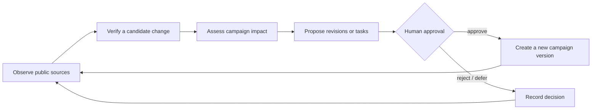
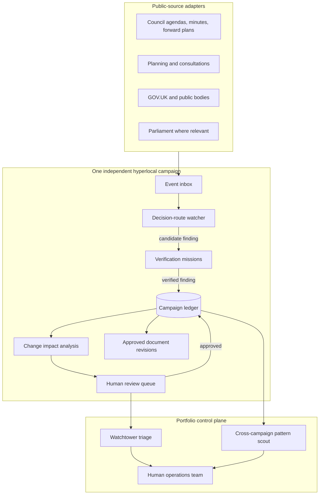

# Campaign Factory: Agent Innovation Landscape

**Research date:** 13 July 2026

**Status:** Historical research proposition. Accepted scope and deferred work are defined by `docs/product/factory-implementation-parameters.md`, the ADRs, and GitHub issue #8.

**Scope:** Agent capabilities beyond the core campaign-generation demonstration, with hyperlocal campaigns treated as independent campaigns rather than centrally generated local variants

## 1. Executive finding

Campaign Factory is currently a campaign generator. Its more credible and more unsettling future is a **campaign operations system**.

The key move is not to add more writer agents, a chat window, or a parade of specialist names. It is to give each hyperlocal campaign a set of bounded agents that can continue working after the initial plan exists:

1. observe relevant public systems;
2. verify claims and changes;
3. assess what the change affects;
4. propose a response or revision;
5. wait for a human decision;
6. record the outcome and continue watching.

That creates a loop:



The factory reveal then becomes **many independent hyperlocal campaigns, each running this loop under human supervision**. The product does not pretend that one national strategy can be copied into 32 boroughs. It shows that a small team could maintain institutional awareness, evidence quality, campaign readiness, and document consistency across a portfolio that would otherwise require a much larger research and operations team.

This is a better expression of “agent factory” because it demonstrates:

- persistence, rather than one-shot generation;
- tool use, rather than conversational answers;
- parallel work, rather than a theatrical sequence;
- critique and verification, rather than unchecked drafting;
- asynchronous operation, rather than making a user watch a spinner;
- human-governed action, rather than autonomous politics;
- portfolio capacity, without erasing local difference.

The recommended conference prototype is an end-of-journey **Agent Operations Panel** with three real missions and one precomputed portfolio reveal:

- **Verify this claim** — a one-off, source-backed verification run;
- **Watch this decision route** — a persistent, read-only monitor of relevant public proceedings;
- **Assess the impact of this change** — identifies affected strategy, tactics, and documents without silently rewriting them;
- **Campaign Control Room** — a precomputed view of many independent campaigns, their active loops, findings, and pending human decisions.

Do not build generic chat. Do not create an agent per document. Do not allow a watcher to modify the campaign by itself.

## 2. Ten-thousand-foot reframing

### The current mental model

```text
Campaign problem -> research -> strategy -> resources -> nine documents -> done
```

This makes a strong planning artefact. It does not yet make a factory. The apparent complexity stops when the documents appear.

### The stronger mental model

```text
Create campaign -> deploy bounded missions -> receive verified findings
       ^                                           |
       |                                           v
new approved version <- human review <- impact and response proposals
```

The first campaign journey remains intact. It creates the campaign’s initial operating model: the decision, evidence, actors, assumptions, objective, theory of change, tactics, organising plan, and resources. The agent system begins once there is enough structured state to supervise.

This resolves an important tension in the concept:

- **Hyperlocality** is preserved because every campaign has its own decision route, evidence, institutions, local knowledge gaps, and approval history.
- **Factory scale** comes from running the same disciplined operating machinery around many different campaigns, not from pretending the campaigns are interchangeable.

## 3. What external evidence changes the design

### 3.1 Parallel agents are useful only where the work genuinely parallelises

Anthropic’s account of its multi-agent research system describes an orchestrator delegating independent research directions to parallel subagents, followed by synthesis and citation checking. It reports large speed gains for complex research but also substantially greater token use and coordination complexity. The lesson is not “use many agents”; it is **reserve multi-agent fan-out for high-value, decomposable work** such as checking many evidence claims or searching several distinct institutions. [Anthropic: How we built our multi-agent research system](https://www.anthropic.com/engineering/multi-agent-research-system)

Therefore:

- one selected claim does not need a swarm;
- a whole-campaign evidence audit can profitably fan out by claim or institution;
- document formatting does not need an agent;
- monitoring multiple distinct public systems can run in parallel;
- synthesis and adjudication must be explicit.

### 3.2 Persistent agents require durable execution, not a long HTTP request

Long-running monitors and approval waits need persisted state, retries, resumability, and an event history. LangGraph documents checkpointed state and interrupt-based human review; Vercel’s current WorkflowAgent guidance similarly describes durable steps that can suspend for approval and survive restarts. Those are architectural requirements, not merely interface choices. [LangGraph durable execution reference](https://langchain-ai.github.io/langgraph/reference/), [LangGraph human-in-the-loop interrupts](https://langchain-ai.github.io/langgraph/how-tos/human_in_the_loop/breakpoints/), [Vercel WorkflowAgent](https://vercel.com/kb/guide/what-is-workflowagent)

Campaign Factory should use a deterministic durable workflow as the spine. Models should perform bounded interpretation, comparison, and drafting steps inside it. Adopting an elaborate graph framework solely to display an elaborate graph would be backwards.

### 3.3 The UK public-data substrate is sufficient for a credible watcher, but fragmented

A watcher can draw on several public systems:

- Parliament’s Developer Hub exposes APIs for parliamentary data, including committees and related work. [UK Parliament Developer Hub](https://developer.parliament.uk/)
- GOV.UK provides a public Search API for published government content. [GOV.UK Search API](https://docs.publishing.service.gov.uk/repos/search-api/using-the-search-api.html)
- Citizen Space provides an unauthenticated, read-only API for published consultation activity where organisations use the platform. [Citizen Space API guide](https://help.delib.net/article/350-api-v2-x-developers-guide)
- Planning Data provides a national platform for planning and housing datasets, although it is not a complete substitute for local planning portals and documents. [Planning Data](https://www.planning.data.gov.uk/)
- Open Council Network provides cross-council full-text search and commercial API access over many UK councils. Its own terms correctly instruct users to confirm information against original records. [Open Council Network search](https://opencouncil.network/about/councils/search), [API access](https://opencouncil.network/api/pricing), [terms](https://opencouncil.network/terms)

Councils are expected to make key decisions, meeting papers, minutes, and related records public, but the implementation and timeliness vary. [GOV.UK: council decision making](https://www.gov.uk/understand-how-your-council-works/decision-making), [Local Government Association: meetings, agendas and minutes](https://www.local.gov.uk/our-support/councillor-and-officer-development/councillor-hub/role-councillor/constitution-and)

The consequence is a **source-adapter architecture**, not a mythical universal council API. Open Council Network can be a discovery layer; the original council record remains the evidence layer.

### 3.4 Monitoring alone is not distinctive

Open Council Network already provides meeting search, topic tracking, summaries, and living knowledge bases. Campaign Factory should not position “AI reads council minutes” as the innovation. Its differentiation must be the path from a detected public event to:

- verified campaign evidence;
- changed assumptions;
- an updated decision route;
- affected tactics and deadlines;
- proposed resource revisions;
- a human decision.

That is a campaign operations loop, not a news alert.

## 4. A useful test for every proposed agent

An agent belongs in the factory only if it passes most of these tests:

| Test | The demanding question |
|---|---|
| Distinct responsibility | Does it own a clear mission rather than a writing style? |
| Variable path | Must it decide what to inspect or which tool to use? |
| Environment | Can it read or act on an external system within explicit permissions? |
| Stateful result | Does its output become a finding, proposal, task, or event with provenance? |
| Repetition | Does the mission recur as the world changes? |
| Verification | Can another source, rule, agent, or human check its work? |
| Product value | Would a campaign team return for this capability after the demo? |
| Demo legibility | Can an audience understand what work was delegated and what came back? |
| Governance | Can it stop before political action and wait for meaningful approval? |

If the only argument is “a specialist prompt might write this section slightly better,” it is not an agent. It is a prompt template.

## 5. Agent innovation landscape

### 5.1 Evidence operations

#### A. Claim Verification Agent — build now

**Mission:** Check or re-check one selected factual claim against current public evidence.

- Receives: claim text, claim type, existing citations, campaign geography, relevant institutions, last verification date.
- Tools: source fetch, targeted public search, original-document retrieval, date extraction.
- Produces: `confirmed`, `qualified`, `conflicted`, `not_found`, or `stale`; supporting and contradicting sources; checked-at date; concise reasoning; confidence.
- Depends on: a structured claim and evidence ledger.
- Why an agent: it must choose an evidence route, inspect source context, handle changed pages, and distinguish absence from contradiction.
- Verification: require source excerpts, original URLs, dates, and a deterministic check that cited documents were actually fetched.
- New failure: false certainty from a superficially matching source.
- Interface: a **Send an agent to verify** action beside claims and in the sources view.

This is the clearest real agent feature because it is bounded, useful, inspectable, repeatable, and capable of producing a visibly different result later.

#### B. Whole-Campaign Evidence Sweep — build after the single-claim version

**Mission:** Reverify all material claims in parallel.

- Fan out by claim or source institution.
- Fan in through a citation and conflict adjudicator.
- Produce an evidence-health report and a queue of claims requiring human attention.
- Never overwrite the original evidence or convert strategic inference into fact.

This is where a research swarm becomes justified. It also creates a strong factory visual: 37 claims checked concurrently, 29 confirmed, 4 qualified, 2 stale, 2 unresolved.

#### C. Source Conflict Resolver — optional specialist

**Mission:** Investigate apparently contradictory official records.

It should compare dates, document status, institutional authority, and whether one source supersedes another. Its valid output can be “the conflict remains unresolved.” A resolver that always resolves is a hallucination machine.

#### D. Campaign Falsifier — high-value later feature

**Mission:** Search for evidence that would weaken the campaign’s factual premise or theory of change.

This is more useful than another supportive researcher. It asks:

- Is the decision already made?
- Is the named institution actually unable to grant the objective?
- Is the campaign relying on an obsolete policy?
- Is a claimed precedent materially different?
- What evidence would make us stop or redesign the campaign?

Its output is an adversarial evidence memo, not an automatic verdict. This has strong trust and demo value because the factory visibly challenges its own work.

#### E. Evidence Gap Dispatcher — human-agent collaboration

**Mission:** Turn unresolved gaps into concrete human research tasks.

Example: “The committee paper does not say whether the cabinet member has delegated authority. Ask the democratic services clerk this exact question.”

The dispatcher is valuable because some hyperlocal knowledge is not online. It should know when to stop searching and create a local human task rather than inventing an answer.

### 5.2 Decision intelligence

#### F. Decision-Route Watcher — build now

**Mission:** Monitor the public systems governing the campaign’s identified decision.

- Receives: decision object, institutions, committees, named public roles, geography, keywords, exclusions, known URLs, review cadence.
- Tools: council agenda/minutes adapters, Open Council Network discovery, direct council pages, consultation APIs, planning data, GOV.UK search, Parliament APIs where relevant.
- Produces: candidate events with source, timestamp, relevance explanation, confidence, and proposed verification task.
- Depends on: an approved campaign and explicit human activation.
- Why an agent: relevant wording can vary; the route may span institutions; source selection and relevance require interpretation.
- Verification: the watcher’s result is never automatically a fact. It creates a candidate change for the Claim Verification Agent or a human.
- New failure: noisy or overbroad alerts; missed records on poorly structured council sites.
- Interface: **Deploy watcher** with a visible list of sources, cadence, and a stop control.

The name matters. “Parliament watcher” is too narrow for hyperlocal campaigns. The monitored object is the decision route; Parliament is one possible source.

#### G. Deadline Sentinel — build with the watcher

**Mission:** Extract and maintain decision windows: consultation deadlines, objection periods, agenda publication dates, meeting dates, and expected decision points.

This should combine deterministic date handling with model-assisted extraction. Dates are high consequence. Every extracted deadline needs its source and timezone, and uncertain dates must be labelled.

#### H. Agenda Triage Agent — strong demo subroutine

**Mission:** When a new agenda appears, locate the relevant item and inspect its attached papers.

It produces:

- the relevant agenda item;
- why it relates to the campaign;
- newly stated recommendations or options;
- documents worth verifying;
- no claim that an item passed until minutes or another authoritative result exists.

This gives the watcher a concrete moment of work the audience can understand.

#### I. Institutional Memory Agent — valuable, less flashy

**Mission:** Reconstruct how the issue and decision have evolved across meetings, papers, amendments, and consultations.

This is particularly useful when the public record is fragmented. It should generate an evidence-linked timeline, record contradictions, and distinguish recommendations from decisions.

#### J. Decision-Route Remapper — build later

**Mission:** Propose an updated decision route when the watcher finds that authority, committee ownership, timing, or process has changed.

It must not silently replace the route. It creates a before/after comparison and asks for approval.

#### K. Public Role Watcher — narrow and safe if constrained

**Mission:** Detect verified changes in public office or committee membership relevant to the decision.

It may update public roles and responsibilities. It must not infer private views, enrich personal profiles, or turn officeholder changes into voter-targeting intelligence.

### 5.3 Strategy maintenance

#### L. Change Impact Agent — build now

**Mission:** Given one verified change, determine what in the campaign may now be wrong, stale, or incomplete.

- Receives: verified finding plus structured campaign version.
- Tools: dependency graph, campaign state retrieval, document section map.
- Produces: affected claims, assumptions, actors, objective constraints, tactics, deadlines, and document sections; severity; recommended review order.
- Why an agent: the relationships are semantic and cross-document; a fixed rule cannot anticipate every implication.
- Verification: show the causal chain: “This changed, therefore these elements may be affected.” Require a human to accept each proposed revision.
- New failure: cascading too many speculative changes from a weak finding.
- Interface: a visible **impact ripple** from the source event into the campaign journey and documents.

This is the missing link between a watcher and a campaign factory. Without it, the watcher is merely an alert service.

#### M. Strategy Red-Team Agent — build or precompute for the demo

**Mission:** Attack the campaign’s theory of change using the current evidence, opposing incentives, resource constraints, and likely counter-moves.

It should answer:

- Which assumption is doing the most work?
- What would the decision-maker do to absorb pressure without conceding?
- Which tactic creates activity but not leverage?
- Which objective is outside the decision-maker’s control?
- Where could the campaign harm the affected community?

The output is a structured challenge and revision proposal, not a second full strategy.

#### N. Campaign Health Check — useful recurring review

**Mission:** Identify drift between current activity and the approved objective, decision route, theory of change, and resource constraints.

It should use campaign-owned progress data, not covert population surveillance. Its findings might be:

- the next three tactics do not pressure the actual decision-maker;
- the campaign is producing content but has no coalition task;
- a critical assumption has not been reverified for 60 days;
- the campaign has passed its decision window.

#### O. Next Decision Window Agent — preferable to a generic “next best action” agent

**Mission:** Identify the next institutionally meaningful moment and propose preparations.

This avoids the manipulative connotations of optimising individual persuasion. The agent is oriented toward public process: a committee meeting, consultation close, budget stage, planning determination, or publication event.

#### P. Precedent and Counterargument Scout — optional mission

**Mission:** Find comparable public decisions and current counterarguments, then test whether they are genuinely comparable.

This is useful before a meeting or strategy review. It should not be continuously active by default.

### 5.4 Operational readiness

#### Q. Meeting Preparation Agent — strong practical feature

**Mission:** Build a current, source-backed preparation pack for a human meeting.

It assembles the latest verified facts, objective, decision route, likely objections, unanswered questions, desired commitments, and evidence gaps. It may draft questions; it does not contact anyone or attend as the campaigner.

#### R. Meeting Debrief Agent — useful but sensitive

**Mission:** Convert human-supplied notes into proposed commitments, facts, questions, and follow-up tasks.

Nothing becomes verified merely because it appeared in notes. Personal and sensitive data require strict retention controls. This is valuable product work but poor early-demo material because it introduces privacy complexity.

#### S. Document Change Propagator — build as a proposal engine

**Mission:** After a human approves a campaign-state change, propose corresponding revisions to the affected document sections.

This is not nine writer agents. One propagation workflow uses the dependency map, fans out only to affected artefacts, and returns a reviewable diff. Formatting and export remain deterministic.

#### T. Campaign Rehearsal Panel — optional and visibly simulated

**Mission:** Let a campaigner rehearse against bounded simulated roles such as a sceptical committee member, journalist, coalition partner, or community attendee.

This is a better use of conversation than an undifferentiated chatbot. The interface must say the positions are simulated and are not evidence about real people.

#### U. Rapid-Response Packager — later

**Mission:** When a verified event materially changes the campaign, assemble proposed holding lines, supporter briefing, internal task list, and document diffs for human approval.

It cannot publish, contact, or submit. Its product value is readiness, not automated amplification.

### 5.5 Portfolio operations

#### V. Portfolio Watchtower — precompute for the conference, build next

**Mission:** Triage findings across many independent hyperlocal campaigns for a small human team.

It answers:

- What changed overnight?
- Which finding has the highest consequence and strongest evidence?
- Which decision window closes soonest?
- Which campaigns require a local human answer?
- Which agents are blocked or producing noise?

This is the factory control plane. It does not merge the campaigns or make their strategies uniform.

#### W. Cross-Campaign Pattern Scout — valuable if carefully framed

**Mission:** Find recurring institutions, policy mechanisms, counterarguments, evidence sources, or operational patterns across campaigns.

It can say, “Five independent campaigns are encountering the same procurement rule.” It must not conclude, “Therefore use the same local strategy.” Shared learning becomes a research lead, not a template imposed on communities.

#### X. Resource Reuse Agent — limited role

**Mission:** Identify reusable research, legal explanations, document components, and operational templates.

Every reused component should declare what is universal, what is local, and what must be reverified. This is efficiency without synthetic localism.

#### Y. Outcome Learning Agent — future feature

**Mission:** Compare recorded expectations with human-recorded outcomes and surface calibration lessons.

Example: “In four campaigns, the assumed decision point was too late; scrutiny committee was the earlier leverage point.” It should learn from public process and campaign operations, not profile voters or infer individual susceptibility.

#### Z. Campaign Portfolio Simulator — conference-only unless validated

**Mission:** Demonstrate how independent campaigns and agent loops would appear at institutional scale using clearly labelled precomputed data.

This is not an autonomous political system. It is a visual explanation of capacity, queues, approvals, and limits.

## 6. Ranking the strongest ideas

Scores are relative: 5 is highest. “Agent need” asks whether an agentic implementation is justified rather than a normal function.

| Capability | Product value | Agent need | Demo value | Build feasibility | Risk profile | Recommendation |
|---|---:|---:|---:|---:|---:|---|
| Claim Verification | 5 | 5 | 5 | 4 | 2 | Build now |
| Decision-Route Watcher | 5 | 5 | 5 | 3 | 3 | Build now, narrow sources |
| Deadline Sentinel | 5 | 3 | 4 | 4 | 2 | Build with watcher |
| Change Impact Agent | 5 | 5 | 5 | 3 | 3 | Build now |
| Document Change Propagator | 5 | 4 | 4 | 3 | 3 | Build after impact mapping |
| Campaign Falsifier | 5 | 5 | 4 | 3 | 2 | Next tranche |
| Strategy Red Team | 4 | 4 | 4 | 4 | 2 | Real or precomputed demo |
| Agenda Triage | 4 | 4 | 5 | 3 | 2 | Implement inside watcher |
| Evidence Gap Dispatcher | 4 | 4 | 3 | 4 | 1 | Next tranche |
| Meeting Preparation | 5 | 4 | 3 | 4 | 2 | Product feature after demo |
| Campaign Health Check | 4 | 4 | 3 | 3 | 2 | Later |
| Portfolio Watchtower | 5 | 5 | 5 | 2 | 3 | Precompute now, build next |
| Cross-Campaign Pattern Scout | 4 | 5 | 4 | 2 | 3 | Later |
| Campaign Rehearsal | 3 | 3 | 4 | 4 | 3 | Optional |
| Meeting Debrief | 4 | 3 | 2 | 3 | 4 | Defer |
| Outcome Learning | 5 | 5 | 4 | 1 | 4 | Future only |

## 7. The end-of-journey Agent Operations Panel

The panel should not resemble a team of cartoon employees or a chat contact list. It is a control surface for delegating bounded work.

### 7.1 Initial panel

```text
AGENT OPERATIONS

Ready to deploy
┌──────────────────────────┐  ┌──────────────────────────┐
│ Verify campaign evidence │  │ Watch the decision route │
│ Checks selected claims   │  │ Monitors 5 public sources│
│ One-off · Read only      │  │ Persistent · Read only   │
│ [Choose claims] [Deploy] │  │ [Review scope] [Deploy]  │
└──────────────────────────┘  └──────────────────────────┘

┌──────────────────────────┐  ┌──────────────────────────┐
│ Stress-test the strategy │  │ Prepare for next meeting │
│ Challenges assumptions   │  │ Builds an approved brief │
│ One-off · No external act│  │ One-off · No contact     │
│ [Set constraints][Deploy]│  │ [Choose meeting][Deploy] │
└──────────────────────────┘  └──────────────────────────┘
```

Each mission card should expose:

- its exact mission;
- which campaign state it can read;
- which public tools it can use;
- whether it persists;
- what it is forbidden to do;
- what output it will create;
- where human approval occurs.

### 7.2 Mission states

Use states that describe work, not anthropomorphic emotion:

```text
Available -> Scoped -> Running / Watching -> Finding created
          -> Waiting for human -> Approved / Rejected / Deferred
          -> Resolved or returns to Watching
```

The visible event history is essential:

```text
09:12  Watcher detected a new committee agenda
09:13  Agenda triage found item 7 potentially relevant
09:14  Verification confirmed the paper proposes a date change
09:14  Impact analysis flagged 2 tactics and 4 documents
09:15  Waiting for Fatima to review proposed changes
```

This is more legible than an animated graph alone. A graph can support the reveal, but the event log proves that work happened.

### 7.3 The panel must not hide the campaign

The campaign journey remains the primary interface. Agent findings should link back into the relevant places:

- a verification badge beside the claim;
- a watcher status on the decision route;
- a deadline finding on the timeline;
- an impact warning on strategy and tactics;
- proposed diffs inside affected documents;
- a consolidated approval queue at the end.

The panel delegates and supervises. The journey explains the campaign.

## 8. Proposed factory architecture



### 8.1 The campaign ledger

The shared state should be an append-only, versioned ledger rather than a mutable blob of generated prose.

Minimum records:

| Record | Purpose |
|---|---|
| Campaign | Stable identity, geography, scope, permissions |
| Campaign version | Approved snapshot of structured campaign state |
| Claim | Fact, inference, assumption, recommendation, or unknown |
| Evidence | Source URL, publisher, date, retrieval time, excerpt, document hash |
| Decision route | Institutions, stages, roles, dates, source basis |
| Dependency | Claim or finding linked to campaign fields and document sections |
| Watch subscription | Sources, terms, cadence, start/stop status, owner |
| Source event | New or changed public material before verification |
| Agent run | Mission, context version, tools, output, cost, status |
| Finding | Structured result with provenance and confidence |
| Proposal | Suggested change or task, never automatically approved |
| Approval | Human decision, reviewer, timestamp, rationale |
| Document version | Approved and proposed artefact versions with diffs |

### 8.2 Why the dependency graph matters

The most visually powerful feature depends on one unglamorous piece of engineering: mapping claims and campaign fields to document sections.

```text
verified meeting-date change
    -> decision timeline
    -> tactic sequencing
    -> volunteer mobilisation date
    -> lobbying pack meeting request
    -> media pack embargo timing
    -> digital pack supporter email schedule
```

Without this map, the system can only regenerate everything and hope for consistency. With it, the system can explain the impact, update only what is affected, and show a meaningful ripple through the factory.

### 8.3 Durable execution recommendation

Use a deterministic TypeScript workflow around model calls:

1. ingest an event;
2. store it idempotently;
3. run relevance assessment;
4. suspend or schedule verification;
5. store fetched source evidence;
6. run semantic comparison;
7. create a finding;
8. run impact analysis;
9. suspend for human approval;
10. create a new version if approved.

Vercel’s durable workflow guidance is relevant to the current deployment model, including persisted steps and human approval. [Vercel: durable web research agent](https://vercel.com/kb/guide/durable-web-research-agent-with-workflow-sdk), [Vercel: human-in-the-loop agents](https://vercel.com/kb/guide/building-human-in-the-loop-agents-for-community-moderation-with-durable-workflows)

Do not make the language model responsible for scheduling, retries, permissions, source deduplication, approval state, or version control.

## 9. Six factory-scale reveals that preserve hyperlocality

### Reveal 1: One public change, nine campaign ripples

**What happens:** A watcher detects a new council committee paper. Verification confirms that the decision date has moved. The impact agent highlights two tactics, one organising milestone, and four document sections that may need revision.

**Why it works:** The audience sees the whole factory react coherently to reality. It turns monitoring into campaign operations.

**Must be real:** source retrieval, evidence display, campaign dependency map, approval gate.

**Can be precomputed:** the exact new paper and completed impact results, with the replay clearly labelled as a recorded run.

**Product value:** very high.

### Reveal 2: The campaign night shift

**What happens:** The system shows what bounded agents found since the team last logged in: a new agenda, a consultation deadline, two reverified claims, one unresolved conflict, and three human decisions required.

**Why it works:** “The agents worked while you were absent” makes persistence tangible without autonomous political action.

**Tension exposed:** it demonstrates institutional capacity and the displacement of routine research labour. It should also show cost, sources, and everything the agents did not do.

**Product value:** high.

### Reveal 3: The Campaign Control Room

**What happens:** Zoom out from the single campaign to 12–20 independent hyperlocal campaigns. Each displays active watchers, last verified state, upcoming public decision window, open findings, and pending human approvals.

**Why it works:** Scale appears without manufacturing fake local variants. The terrifying number is not content produced; it is institutional attention maintained.

**Must be real:** the data model and at least two genuine campaign records or recorded runs.

**Can be simulated:** the remainder of the portfolio, clearly labelled “demonstration data.”

**Product value:** extremely high once the single-campaign loops work.

### Reveal 4: Send the factory to disprove itself

**What happens:** A human selects the campaign’s most important assumption and deploys a falsifier. Several research branches search for counter-evidence and an adjudicator reports which assumption survives.

**Why it works:** The factory looks powerful because it can challenge itself, not because it speaks confidently.

**Risk:** an audience may mistake model debate for truth. Source evidence and unresolved states must dominate the interface.

**Product value:** high.

### Reveal 5: The decision-window catch

**What happens:** The watcher detects a relevant public consultation or committee date that the original campaign did not know about. It proposes an updated sequence and meeting-preparation task before the window closes.

**Why it works:** It answers the practical campaign question, “What can I still affect, and by when?”

**Product value:** very high, but the live source should be carefully chosen or precomputed for reliability.

### Reveal 6: Shared learning without cloned campaigns

**What happens:** The portfolio scout identifies that six unrelated local campaigns are encountering the same institutional rule or supplier. It offers a shared evidence dossier while preserving six separate objectives, community contexts, and strategies.

**Why it works:** It shows organisational intelligence emerging from a portfolio rather than central strategy being imposed on local campaigns.

**Risk:** centralisation and loss of local autonomy if patterns become mandates.

**Product value:** high later, premature for the first prototype.

## 10. Recommended conference reveal

Combine Reveals 1 and 3.

### Part one: make one campaign come alive

At the end of the existing journey, reveal the Agent Operations Panel. Deploy three missions:

1. **Verify:** check a selected material claim live against a stable source.
2. **Watch:** replay or retrieve a relevant new public meeting item.
3. **Impact:** show the verified change rippling into the campaign journey and affected documents.

Stop at a visible human approval gate. The presenter does not need to accept the changes.

### Part two: reveal the factory

Zoom out to the Campaign Control Room:

```text
18 independent hyperlocal campaigns
63 public sources under watch
11 findings since yesterday
4 decision windows inside 14 days
3 claims now stale
7 changes waiting for human approval
0 messages sent, submissions made, or documents published automatically
```

The final line is as important as the scale. It makes the capability feel powerful without pretending governance has disappeared.

The “terrifying” moment is: **one small campaign team can maintain current, source-backed operational awareness across 18 different local decision systems at once.**

## 11. What to build, precompute, simulate, and reject

### Build for real

- claim and evidence ledger;
- one-claim verification run;
- verification history and statuses;
- watcher subscription model;
- one reliable council/meeting source path plus direct-source confirmation;
- deadline extraction;
- campaign-to-document dependency map for a limited set of fields;
- change impact report;
- explicit approval queue;
- persistent mission states and event log.

### Precompute but replay honestly

- a particularly good council agenda or minutes detection;
- a completed multi-claim evidence sweep;
- the 12–20 campaign portfolio;
- historical watcher events;
- a strategy red-team result;
- noisy-source and unresolved-conflict examples.

Label recorded runs and demonstration campaigns. “Simulated” should be a visible state, not presenter fine print.

### Simulate only at the interface boundary

- additional portfolio campaigns;
- larger agent concurrency counts;
- sources not yet integrated;
- future cross-campaign pattern findings.

The underlying event shapes, approval states, and provenance model should be real even when the data is seeded.

### Reject

- **Generic campaign chat:** old interaction model, weak delegation, hides provenance and boundaries.
- **One writer agent per document:** prompt proliferation masquerading as organisation design.
- **One agent per source:** adapters and functions should own predictable retrieval; agents reason across sources.
- **Approval agent:** approval is a human action with deterministic workflow support.
- **Automatic campaign updater:** destroys provenance and can silently corrupt strategy.
- **Autonomous publication, lobbying, contacting, or consultation submission:** unacceptable political authority transfer.
- **Voter sentiment or persuasion optimiser:** creates profiling and microtargeting pressure.
- **Synthetic local voice agent:** a machine should not manufacture the appearance of community consent.
- **Always-on roleplaying personas for real decision-makers:** simulation can be rehearsal, never intelligence about the actual person.

## 12. Failure modes and controls

| Failure | Consequence | Control |
|---|---|---|
| Watcher matches irrelevant agenda wording | Alert fatigue | campaign-specific scope, negative keywords, relevance threshold, easy feedback |
| Source page changes or disappears | False “no evidence” result | distinguish fetch failure, not found, and contradiction; archive retrieval metadata |
| Aggregator differs from council record | Incorrect claim | aggregator for discovery; original record for verification |
| Meeting recommendation treated as decision | Premature campaign response | document-type and status rules; require authoritative outcome evidence |
| Model invents an implication | Strategy corruption | impact chain with evidence and field references; human approval |
| Whole-campaign sweep becomes expensive | Demo latency and cost | tiered checks, cached source retrieval, bounded concurrency, precomputed fallback |
| Agent panel becomes architecture theatre | Campaign disappears | findings embedded into journey; panel remains secondary control surface |
| Portfolio implies cloned local campaigns | Product-owner rejection, loss of trust | show independent objectives, institutions, local gaps, owners, and approval histories |
| Monitoring becomes surveillance | Political and legal harm | public institutional sources only by default; no identifiable voter tracking |
| Agent’s confidence becomes authority | Misleading certainty | factual status, source authority, recency, and unresolved conflict shown separately |

Political campaigning that targets particular individuals can fall within direct-marketing and profiling obligations; the ICO emphasises transparency, lawful basis, objection rights, purpose limitation, and data minimisation. The safe prototype boundary is public institutional information and campaign-owned operational data, not individual voter data. [ICO political campaigning and direct marketing guidance](https://ico.org.uk/for-organisations/direct-marketing-and-privacy-and-electronic-communications/guidance-for-the-use-of-personal-data-in-political-campaigning-1/political-campaigning-opinion-research-and-direct-marketing/), [ICO purpose limitation and data minimisation](https://ico.org.uk/for-organisations/direct-marketing-and-privacy-and-electronic-communications/guidance-for-the-use-of-personal-data-in-political-campaigning-1/purpose-limitation-data-minimisation-and-storage-limitation/)

## 13. Product boundaries

The factory should state these as enforceable product rules:

1. Public institutional data by default.
2. No identifiable voter profiling or susceptibility scoring.
3. No autonomous publication, submission, messaging, lobbying, or outreach.
4. No inferred private positions presented as fact.
5. No invented local voices, supporters, evidence, or community consent.
6. Every factual finding carries source provenance and retrieval time.
7. Facts, strategic inferences, simulations, and unknowns are visibly distinct.
8. Watchers create candidate events; verification creates findings; humans approve campaign changes.
9. Agents never overwrite an approved campaign version.
10. Every persistent agent has explicit scope, owner, stop control, cadence, and audit history.
11. Every simulated or precomputed run is labelled.
12. Cross-campaign learning offers hypotheses and reusable evidence, not mandatory local strategy.

## 14. Implementation sequence

### Foundation: campaign ledger and mission model

- normalise claims, evidence, decision route, campaign fields, and document-section identifiers;
- add `agent_run`, `finding`, `proposal`, `approval`, `watch_subscription`, and version records;
- implement append-only event history;
- add explicit fact/inference/unknown types.

This is the least visible work and the most important. Without it, every future agent will return more prose into an already prose-heavy application.

### Slice 1: verification mission

- “Send an agent to verify” on one claim;
- fetch and store source material;
- produce the five-state result;
- show retrieval time, sources, and history;
- support re-verification without overwriting the previous result.

### Slice 2: decision-route watcher

- let the user review and activate its scope;
- support one reliable council source family plus Open Council Network discovery;
- ingest agendas/minutes and extract relevant items and deadlines;
- create candidate events, not campaign changes;
- build a recorded demo fallback.

### Slice 3: impact ripple

- map the selected decision date, decision-maker, objective constraint, and tactic dates into relevant document sections;
- run impact analysis on a verified finding;
- display affected journey sections and document diffs;
- stop at approval.

### Slice 4: operations panel and control room

- show mission permissions, states, event histories, and pending decisions;
- seed a transparent demonstration portfolio of independent campaigns;
- provide a smooth zoom from one campaign to portfolio state;
- keep live counts based on real or labelled seeded records.

### After the event

- whole-campaign evidence sweep;
- campaign falsifier;
- campaign health check;
- meeting preparation;
- cross-campaign pattern scout;
- source coverage expansion;
- calibrated outcome learning only after real structured outcome data exists.

## 15. Hard questions the next product discussion must settle

1. Is the post-generation product primarily an **operations console**, or does the owner still see Campaign Factory as a one-time planning experience?
2. What exactly is the unit the watcher monitors: a decision, a topic, a place, an institution, or a configurable combination?
3. Which campaign claims are material enough to verify individually, and who marks them?
4. Can a user activate a persistent watcher, or should every monitoring subscription require an administrator?
5. Which single council/public-source path can be made reliable enough for the conference demo?
6. How much of the campaign state can be structured without damaging the clear narrative experience?
7. Should an approved finding ever trigger draft revisions automatically, or must a human explicitly request the propagation run?
8. What does “many campaigns” mean organisationally: one campaign team’s portfolio, many client organisations, or a demonstration-only national view?
9. What counts as local knowledge that the factory must request from a human rather than search for?
10. How conspicuously should cost, token use, and source coverage be shown in the control room?

## 16. Bottom line

The credible leap is not “Campaign Factory now has 40 agents.” It is:

> Campaign Factory can create a campaign, keep its public evidence and decision route under bounded observation, challenge its own assumptions, show exactly what changed, propagate approved changes through operational resources, and let a small human team supervise those loops across many genuinely different hyperlocal campaigns.

That is both useful and unsettling. It shows capacity previously associated with a large campaign organisation while preserving public-source provenance, local difference, and human political responsibility.
