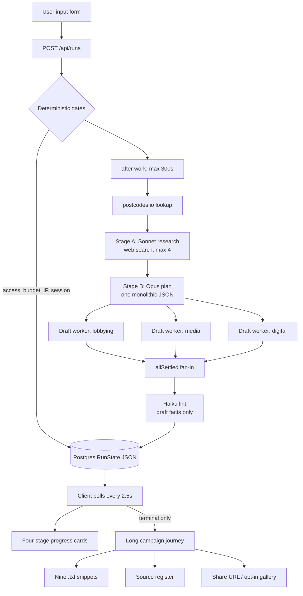
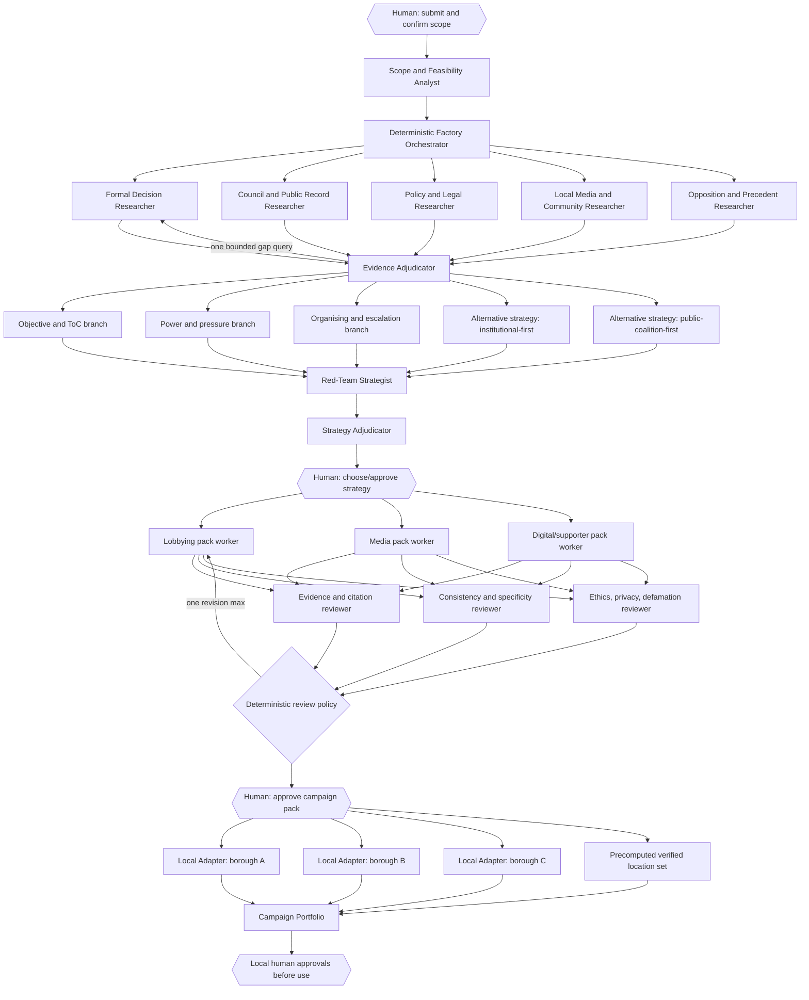

# Campaign Factory: adversarial multi-agent architecture review

**Review date:** 13 July 2026

**Status:** Historical adversarial review. Where its recommendations differ, the accepted implementation plan and ADRs govern.

**Reviewed surface:** current working tree, primarily `web/`; `app/` treated as the retired prototype

**Evidence used:** repository and prompt inspection, a production build, lint, and browser inspection of `/`, `/dev/preview`, and the document library using the bundled real campaign fixture

**Not exercised:** a new paid live model run, external publication, or destructive operations

> Method note: this review began before the installed Grill With Docs wrapper was located. The subsequent product interview used the installed wrapper plus its upstream grilling/domain-model approach, and the accepted decisions are captured in the implementation plan and ADRs.

## 1. Executive verdict

Campaign Factory is a strong **single-campaign generation workflow** presented as a polished campaign report. It is not currently a multi-agent system, and it does not currently demonstrate a factory.

The executable system is a deterministic pipeline around at least six model requests: one bounded web-research call, one monolithic plan call, three parallel pack-writing calls, and one lint call. Its strongest qualities are the shared typed campaign object, visible verification labels, partial-result semantics, and refusal to manufacture a synthetic fallback. Its strongest demo weakness is that almost all of the work is invisible until the end. The audience sees a long report with small robot labels, not coordination, parallelism, dispute, revision, or scale.

The current working-tree interface makes the story less trustworthy. Labels such as `scout · verifier`, `strategy · power · tactics`, and `all specialists reviewed` describe specialists that do not exist as independent runtime actors. The chips are simulated agent activity without being labelled as simulation. That is precisely the kind of agent theatre this review should reject.

There are also several material implementation/story mismatches:

- The promised nine documents are not the nine documents in the brief. The UI exports nine small communication artefacts, while the Campaign Brief, Theory of Change, Power Map, Strategy, Timeline, and Organising Plan are non-exportable scroll sections.
- “Four model calls” is inaccurate. A normal successful run makes at least six requests, plus possible parsing retries and server-tool resumptions.
- “Progressive reveal” is not implemented. The campaign journey appears only when the run reaches a terminal state.
- The “live research feed” is sparse status notes. The streamed research-text hook is not connected to the job runner.
- Lint runs after drafting, not in parallel with it, and flagged documents remain immediately copyable and downloadable.
- “Per-stage retry” is not implemented. Retry launches and charges a new complete run.
- Human approval is described in generated text, but there is no approval state or approval gate.
- The current Vercel execution path has a 300-second ceiling for a pipeline measured at 15–18 minutes. It is knowingly unable to finish a normal live run on the configured plan.
- Source status is assigned by the same research model that found the source. Tool-native citation evidence is not preserved and independently re-fetched before a claim becomes “Verified public information.”

**Recommendation:** build **Option B, Persuasive agent factory**, but be selective. Deliberately overengineer the parts where multiplicity creates real value and a legible reveal: parallel public-record research, independent evidence adjudication, competing strategy branches, specialist review panels, and local adaptation across a portfolio. Keep the orchestrator, state transitions, safety rules, exports, approvals, and task limits deterministic.

The strongest conference reveal is: **one approved central campaign becomes 32 borough-level campaign variants on a London map, with three variants fully inspected live and all 32 precomputed from real public sources, timestamped, and visibly awaiting local human approval.** The animation may be rehearsed; the data and outputs must be real. The unsettling moment is not “look at 80 bots.” It is “a three-person team has just acquired a research, strategy, production, and local-adaptation apparatus across an entire political geography.”

## 2. Current application architecture

### 2.1 Executable input-to-output map



### 2.2 Stages, logic, and data

| Stage | Actual implementation | Input | Output | Main limitation |
|---|---|---|---|---|
| Intake | React form plus minimum-length check | Problem and eight optional text fields | `RunInput` | No structured ambiguity/feasibility result, data-sensitivity warning, or confirmation loop |
| Launch controls | Deterministic API checks | Access code, cookie, IP, spend ledger | Accepted/rejected run | Counters increment before the run starts; no queue or capacity model beyond hard rejection |
| Geography | Keyless deterministic lookup | Postcode found in location/problem | One `SourceClaim` | No postcode means no deterministic geography resolution |
| Research | One Sonnet call with web search, max four searches | User input | `ResearchResult` | Breadth is artificially capped; the researcher labels its own evidence |
| Plan | One Opus call with a prompt-embedded JSON schema | Input plus full research object | `Plan` | No runtime schema validation; objective, power, pressure, strategy, tactics, and organising are one long bottleneck |
| Drafts | Three parallel Sonnet structured-output calls | Plan plus first 20 claims | `DraftsLobbying`, `DraftsMedia`, `DraftsDigital` | They are pack workers, not autonomous agents; later claims are discarded from context |
| Lint | One Haiku evaluator call | Drafts plus first 25 claims | `LintResult` | Checks only draft-specific facts; no citation fetch, plan review, strategy review, ethics review, or automatic block |
| Persistence | Whole `RunState` JSON written through to Postgres | Mutable in-memory state | Pollable run and campaign | No append-only event log, task table, field-level provenance, versioning, or conflict control |
| Progress | Polling UI with four stage cards and notes | `RunState` | Status display | Cards compress six-plus requests into four theatrical “agent” stages; no actual partial campaign display |
| Journey | Single 628-line client component | Completed/partial `Campaign` | Thirteen-section report | Campaign is readable, but there is no provenance per section, comparison, revision, or approval workflow |
| Documents | Client-side string selection and Blob download | Nine selected draft fields | `.txt` downloads | Does not generate the promised nine campaign documents; no bundle, version, PDF/DOCX, or source appendix |
| Gallery | Explicit owner action | Campaign and optional title | Public listing | Human-triggered, but no pre-share risk or accuracy gate |

### 2.3 Shared campaign state

The system has one useful shared object: `Campaign` inside `RunState`. Research, plan, drafts, sources, lint, stage completion, cost, and notes are kept together. This is a sound seam for a workflow.

It is not adequate shared state for a real agent factory. It lacks:

- immutable evidence records and tool-result hashes;
- claim-to-source and artefact-to-claim lineage;
- per-task ownership, attempt count, timing, and failure state;
- strategy branches and adjudication reasons;
- revisions and supersession history;
- reviewer decisions and unresolved findings;
- human approvals with scope and identity;
- location variants with inheritance from central strategy;
- event history suitable for replaying the factory honestly.

Letting many agents write this one JSON blob would create races and silent overwrites. The state model must be changed before increasing concurrency.

### 2.4 Live, generated, mocked, and claimed

| Element | Reality today |
|---|---|
| Postcode result | Live, deterministic public-data lookup when a postcode is present |
| Web research | Live model tool use, bounded to four searches |
| Verification label | Generated judgement, enum-coerced in code; not independent verification |
| Objective, power map, strategy, tactics, organising | Generated by one plan call |
| Lobbying, media, digital resources | Generated by three parallel pack calls |
| Lint | Real independent model call, but narrow and advisory |
| Map | Explicit fixed visual placeholder |
| Agent chips | Simulated agent activity in the current working tree |
| Human approval | Text in tactics and warnings; not a persisted workflow gate |
| “Live campaign, generated just now” | Also shown on old shared campaigns and the fixture, so not reliably true |
| Gallery | Real opt-in publication action |
| Durable execution | Planned, not implemented |

### 2.5 Bottlenecks and fragile dependencies

1. **Stage A is a long pole and a single point of research failure.** Four searches must cover ownership, policy, process, precedent, local media, allies, opponents, and current officeholders.
2. **Stage B is a coherence monolith.** This protects consistency, but prevents visible parallel analysis, alternative strategies, and targeted rework.
3. **The execution host is incompatible with measured latency.** `after()` plus `maxDuration = 300` cannot carry a 15–18 minute pipeline.
4. **State persistence is durable; execution is not.** A killed worker can leave a run indefinitely “running,” with no lease, heartbeat, watchdog, resume, or cancellation.
5. **Research provenance is model-transcribed.** Raw web-search result blocks and citation identifiers are not turned into immutable evidence records.
6. **Prompt-JSON is trusted too far.** Stage B has a schema in the prompt but no runtime validation, despite Zod being installed.
7. **The UI has no recovery from a missing poll response.** `pollRun()` returns `null`; the progress screen can simply keep polling.
8. **Errors are displayed raw.** The interface claims internal errors are hidden, but stage error strings are rendered to users.
9. **There are no automated tests.** Production build passes; lint currently fails with 16 errors.
10. **The current fixture demonstrates an integrity failure without enforcing a consequence.** Sixteen lint findings are shown at the very end while the implicated documents remain one-click downloads.

## 3. What is genuinely agentic today

### 3.1 Maturity classification

| Component | Classification | Verdict |
|---|---|---|
| Form validation, access/budget/session gates, label coercion, cost arithmetic, DB writes | Deterministic application logic | Genuine and appropriately deterministic |
| Postcode lookup | Deterministic application logic plus external tool | A function, not an agent |
| Research system/user messages | Prompt template | Strong constraints, but still a template |
| Stage A research | Tool-using agent | The only clearly agentic runtime component: it decides and performs bounded web searches inside one model turn |
| Stage B planning | Single model call | A specialist prompt, not an agent; no tools, independent goals, memory, or iterative actions |
| Stage C pack generation | Three single model calls in a fan-out | Parallel workers in a fixed workflow, not autonomous agents |
| Lint | Evaluator or critic | A real fresh-context evaluator, but one pass, advisory only, and not part of a revise loop |
| `runPipeline()` | Fixed workflow with limited branches | Code-controlled sequence, not model-controlled orchestration |
| `Promise.allSettled()` draft fan-out | Fan-out/fan-in workflow component | Useful parallelism, but parallel calls alone do not make a multi-agent system |
| Research parse retry and plan parse retry | Fixed branching workflow | Deterministic repair instruction, not agent planning |
| `RunState` | Shared workflow state | Not agent memory; it is a mutable campaign record |
| Progress “agent” chips | Simulated agent activity | The labels exceed the implementation |
| Generated tactic `approval` strings | Prompt output | Not a human approval gate |
| Start run, copy, download, share, delete | Human-triggered application actions | Human actions, but only share/delete are meaningful gates |
| Whole system | Fixed workflow containing one tool-using agent and one critic | Not an orchestrated multi-agent system |

### 3.2 Where terminology is misleading

- `scout · verifier` suggests two independent actors. Research and verification are performed by one call.
- `strategy · power · tactics` suggests three collaborating specialists. One Opus response creates all of them.
- `strategy · all specialists reviewed` is false. No specialist review panel runs.
- `lobbying · media · digital` accurately describes three parallel prompts, but calling them agents would still overstate autonomy.
- `verifier` overstates the lint stage. It checks a subset of draft factual details against a sliced claim list; it does not verify sources, citations, strategy, stakeholder positions, or conflicts.

The current app should either remove these chips or label them **“simulated factory view”** until the corresponding task records and model calls exist.

## 4. Where the current experience underuses multi-agent systems

### 4.1 Research breadth and independence

The clearest opportunity is research. Ownership, committee process, current policy, legal authority, local media, community organisations, precedents, opposition arguments, and source verification are different search problems. They can run in parallel, use different source priorities, and be adjudicated against a common evidence schema. This is where agents can reduce wall-clock time while increasing breadth.

The current four-search cap is stage-safe but intellectually cramped. It encourages one search path to dominate and leaves predictable gaps, visible in the fixture: current mayor, ward councillors, exact hours, local groups, and remaining procedural routes.

### 4.2 Conflicting hypotheses

The fixture shows the system productively reframing a false closure premise. That should become explicit. Two researchers should be allowed to test competing hypotheses, followed by an adjudicator that records why the original framing was accepted, modified, or rejected. This is better than one call silently changing the brief.

### 4.3 Strategy alternatives and adversarial review

One coherent plan is useful, but it hides choice. A conference audience will understand agency when three strategy branches emerge from the same evidence:

- an institutional/private-engagement route;
- a public/coalition-pressure route;
- an organising/escalation route.

A red team can then attack feasibility, evidence, ethics, resource assumptions, and escalation risk. An adjudicator can select or combine branches, with reasons. This is substantively useful and visually legible.

### 4.4 Review loops

The existing lint call is a good seed but stops too early. Independent review should cover:

- evidence and citation integrity;
- cross-document strategy consistency;
- specificity and generic-language detection;
- stakeholder hallucination and position inference;
- defamation, privacy, political ethics, and synthetic-localism risk;
- accessibility and plain-language quality.

The reviewers should return typed findings. A deterministic policy should decide whether the relevant producer gets one bounded revision, whether the issue is merely labelled, or whether human approval is required.

### 4.5 Scale beyond one campaign

The largest underuse is architectural, not rhetorical. The database stores independent runs and a gallery. There is no `CampaignPortfolio`, central strategy, location variant, shared resource, cross-location comparison, or adaptation lineage. The app produces one campaign at a time, so it demonstrates content generation, not institutional capacity.

### 4.6 Operational artefacts

The application drafts communications but does not create an operating system for a campaign. It lacks owners, due dates, contact plans, volunteer capacity, review queues, event plans, coalition status, and learning metrics. Some belong in structured application state, not prose documents. Agents could update proposed plans, but deterministic task and approval systems should own execution.

## 5. Where adding agents would be pointless

| Proposed label | Better implementation | Reason to reject the agent |
|---|---|---|
| Ambiguity Detector | Required-field/rubric function plus one scoping model call | A standalone agent adds a round trip to produce a checklist |
| Geographic Scope Resolver | Postcodes.io, ONS/GSS identifiers, authority lookup | Geography is deterministic and should stay auditable |
| Minimum Viable Win Agent | Field within the objective strategist’s schema | Too coupled to objective and theory of change to merit a separate context boundary |
| Campaign Feasibility Assessor | Rubric evaluator over evidence and resources | Useful evaluation, but not an open-ended agent unless it must research missing constraints |
| Separate Electoral, Reputational, Legal, Operational Pressure Agents | Parallel analysis fields inside two pressure specialists | Four isolated agents would duplicate context and fragment the pressure model |
| Every tactic as an agent | Structured tactic generator plus feasibility evaluator | Tactics do not need autonomy, tools, or memory |
| Every email/post writer as an agent | Three audience-pack workers | Fifteen “writer agents” inflate count and cost without adding capability |
| FAQ Writer, Talking Points Writer, Objection Handler | Fields produced by the relevant pack worker | These are artefacts, not actors |
| Accessibility Reviewer for plain text only | Deterministic readability and document checks, then optional model review | Most checks are deterministic |
| Final Human-Review Packager Agent | Deterministic assembler | It should not decide what passed; it should compile recorded reviews and approvals |
| Factory Orchestrator as an unconstrained LLM | Deterministic graph/state machine | Safety, budget, retries, and stage truth must not be delegated to a narrator model |
| Recursive Delegation in the conference prototype | Fixed maximum-depth graph | Recursion is hard to explain, bound, and recover live |
| Background Monitoring Agent before a durable runner exists | Scheduled ingestion jobs plus bounded classifiers | Monitoring multiplies operational risk before the single-run path is reliable |

The rule is simple: if the component can be expressed as a pure function, schema validation, lookup, queue transition, or bounded evaluator, keep it that way. The interface may show many **tasks** without lying that every task is an agent.

## 6. Agent opportunity map

The following are the only roles this review proposes as actual model-driven specialists. “Now” means Option B. “Optional” means useful after the conference or only for certain campaigns. Pack workers are included to show why they remain workers rather than agents.

| Role | Ownership, context, tools, structured output | Dependencies and sequencing | Why agent rather than function; campaign and demo value | New failure and verification | Visibility and status |
|---|---|---|---|---|
| Scope and Feasibility Analyst | Owns interpreted problem, scope, missing facts, sensitive-data flags, success constraints. Receives user input. May call geography and authority lookup tools. Produces `ScopeBrief`. | First; blocks research fan-out only on unsafe/out-of-scope input | Model judgement is useful when the user’s institution or desired decision is ambiguous. Makes the initial decomposition visible. | Can prematurely narrow the brief. Verify with deterministic geo output and a human-editable scope card. | Visible summary; **real now** |
| Formal Decision Researcher | Owns statutory authority, formal decision, committees, officers, deadlines, intervention points. Receives `ScopeBrief`. Uses web search and official-site/PDF retrieval. Produces claims and a `DecisionRoute`. | Parallel research lane; strategy depends on it | Open-ended institutional navigation and PDF search justify tools and iteration. Directly improves target accuracy. | May confuse formal and delegated authority. Evidence Adjudicator must re-fetch load-bearing claims. | Visible lane; **real now** |
| Council and Public Record Researcher | Owns minutes, agendas, decisions, consultations, planning records, and current implementation state. Official-source tools and PDF extraction. Produces evidence records and `PublicRecordTimeline`. | Parallel with other research | Multi-hop document search is agent-worthy and visually compelling. | Bad PDF extraction, stale agendas, same-name committees. Verify URL, date, document title, page/section. | Visible lane; **real now** |
| Policy and Legal Researcher | Owns relevant policy, statutory duties, regulations, guidance, and legal uncertainty. Receives scope and decision route. Uses GOV.UK, legislation, regulator sources. Produces `PolicyConstraints`. | Parallel; feeds strategy and safety review | Source selection and cross-jurisdiction interpretation need bounded judgement. | Can overstate legal conclusions. Must label legal analysis as information, not advice, and require authoritative citations. | Visible when relevant; **real now, conditional** |
| Local Media and Community Researcher | Owns local outlets, public community organisations, existing campaigns, and public statements. Public web tools only. Produces organisations and public-source claims, never personal profiles. | Parallel; feeds coalition/media planning | Broad local discovery benefits from search exploration and gives local texture. | Synthetic localism, stale groups, inferred positions. Require public organisational sources and “position unknown” by default. | Visible lane; **real now** |
| Opposition and Precedent Researcher | Owns counterarguments, prior campaigns, comparable decisions, likely institutional rebuttals. Uses public web search. Produces `Counterarguments` and `Precedents`. | Parallel; feeds alternative strategies and red team | A distinct adversarial search objective counters confirmation bias. Strong live reveal when it challenges the user’s premise. | False equivalence or partisan source bias. Adjudicator scores source authority and relevance. | Visible lane; **real now** |
| Evidence Adjudicator | Owns claim status, conflicts, gaps, and rejection reasons. Receives all candidate evidence without researchers’ conclusions where possible. Can re-fetch targeted URLs/search gaps. Produces immutable `ClaimDecision[]`. | Fan-in after research; one bounded re-query round | Independent fresh-context verification is the strongest quality gain over the current design. | The verifier can also hallucinate. Require tool evidence for “verified,” deterministic URL/date checks, and explicit unresolved status. | Highly visible review gate; **real now** |
| Objective and Theory-of-Change Strategist | Owns objective, minimum viable win, assumptions, causal chain, success measures. Receives adjudicated claims and constraints. Produces `ObjectiveBranch`. | Parallel strategy lane after evidence gate | Coherent causal judgement is not reducible to a function. Makes the missing theory of change explicit. | Can create a plausible but unsupported causal story. Red team tests every assumption. | Visible strategy branch; **real now** |
| Power and Pressure Strategist | Owns stakeholder roles, power relationships, verified/inferred positions, pressure mechanisms. Receives evidence and decision route. Produces graph nodes/edges and pressure hypotheses. | Parallel with objective/organising branches | Network synthesis is distinct, checkable, and benefits from a graph tool. | Defamation and invented relationships. Default positions to unknown; require evidence or explicit inference. | Visible graph; **real now** |
| Organising and Escalation Strategist | Owns participation model, coalition route, capacity, sequence, escalation conditions, and human gates. Receives resources and selected objective. Produces `OrganisingBranch`. | Parallel strategy lane, then adjudication | Must reason across capacity and sequencing, not just generate content. | Unrealistic volunteer assumptions or unsafe escalation. Resource and ethics reviewers challenge it. | Visible branch; **real now** |
| Alternative Strategy Agent, two instances | Each owns a complete but differently constrained strategy: institutional-first and public/coalition-first. Same adjudicated evidence, different declared objective function. Produces `StrategyCandidate`. | Parallel; no communication before adjudication | Competing solutions reveal choice, reduce single-answer authority, and are excellent theatre with product value. | Cosmetic diversity, duplicated plans, or optimisation for evaluator preference. Force distinct constraints and scorecards. | Visible comparison; **real now** |
| Red-Team Strategist | Owns the strongest case against each candidate: feasibility, evidence gaps, political backlash, resource mismatch, ethics. Read-only access to candidates and evidence. Produces typed objections and severity. | After candidates; before selection | Adversarial critique is qualitatively different from self-review. | Overly conservative vetoes or performative criticism. Use a rubric and separate “block” from “trade-off.” | Visible challenge round; **real now** |
| Strategy Adjudicator | Owns selection or bounded synthesis, with reasons and unresolved trade-offs. Receives candidates and red-team results. Produces `SelectedStrategy` plus decision record. | Fan-in; human approves before production | Judgement across competing branches is model-worthy, but only within fixed candidates and rubric. | Hidden preference or fabricated consensus. Persist scores, reasons, and dissent; human can choose another branch. | Visible selection gate; **real now** |
| Lobbying Pack Worker | Owns briefing, request, agenda, talking points, objections, follow-up. No tools. Produces structured artefacts. | Parallel after approved strategy | A normal structured prompt does this as well as an agent. Keep it a worker. Quality comes from better evidence lineage. | Unsupported details. Fact reviewer plus deterministic placeholders. | Visible as a production cell, not an agent; **real current worker** |
| Media Pack Worker | Owns release, pitch, Q&A, draft role-based quotes, timing, visual brief. No tools. | Parallel production | Same: a worker is sufficient. | Defamation, invented quote/date, bad news judgement. Media-risk and fact review. | Visible cell; **real current worker** |
| Digital and Supporter Pack Worker | Owns action page, email, volunteer message, posts, FAQ, coarse public audience variants. No personal targeting tools. | Parallel production | A structured worker is sufficient; the safety boundary matters more than autonomy. | Microtargeting creep, platform-policy risk, synthetic urgency. Ethics review and field-level provenance. | Visible cell; **real current worker** |
| Evidence and Citation Reviewer | Owns factual entailment, citation correctness, link availability, and `[VERIFY]` coverage across plan and all artefacts. Can re-fetch cited public sources. Produces findings and block/warn status. | Parallel review panel after production; one bounded revision loop | This is materially broader than current lint and needs tools. | False positives and link volatility. Preserve snapshots/hashes and let humans override with reason. | Visible panel; **real now** |
| Strategy Consistency and Specificity Reviewer | Owns objective-to-tactic traceability, cross-document consistency, generic-language detection, owner/timing completeness. Produces typed findings. | Parallel review panel | Rubric-based model evaluation adds value; deterministic checks cover required fields first. | Reviewer preferences masquerade as defects. Show rubric and evidence. | Visible panel; **real now** |
| Ethics, Privacy, Defamation, and Synthetic-Localism Reviewer | Owns prohibited targeting, unsupported allegations, fake-grassroots language, autonomous-action risk, and local-authenticity claims. Produces block/warn findings. | Parallel review; blocks export/share where policy says so | Contextual risk needs judgement, but enforcement remains deterministic. | Overblocking legitimate advocacy or missing coded language. Human safety approval and logged override. | Visible gate; **real now** |
| Local Adaptation Agent | Owns one location variant within an approved central strategy. Receives immutable central brief, local public evidence, and prohibited-change rules. Uses local public-source tools. Produces local delta, not a full rewrite. | Fan-out only after central human approval; one per location | Local research and constrained adaptation are the core scale capability. | Synthetic localism, false local groups, drift from central strategy. Require local evidence, diff view, and named local reviewer. | Main final reveal; **three live/precomputed pilots now, wider set precomputed** |
| Cross-Location Comparator | Owns shared patterns, exceptional locations, evidence gaps, and reusable resources. Receives approved location variants. Produces portfolio matrix and recommendations, not outreach. | Fan-in after variants | Map-reduce synthesis creates genuine portfolio intelligence. | Erases local exceptions or ranks communities reductively. Expose source counts and exceptions; no voter scoring. | Visible portfolio summary; **optional now, real after event** |

## 7. Option A: Credible minimum

### 7.1 Shape

Add a small research cell and one strategy critique loop around the current workflow.

**Actual model-driven specialists:**

1. Formal Decision Researcher
2. Local Context Researcher, combining public record, media, and community search
3. Evidence Adjudicator
4. Red-Team Strategist

Keep the current single coherent plan call and three draft workers. Rename workers honestly.

### 7.2 Orchestration, state, and sequence

```text
Input -> deterministic scope -> [Decision Researcher || Local Context Researcher]
      -> Evidence Adjudicator -> current Plan call -> Red Team
      -> at most one Plan revision -> [3 current pack workers]
      -> expanded lint -> human review -> journey/documents
```

- **Pattern:** deterministic graph, fan-out/fan-in, planner-reviewer loop.
- **State:** current `Campaign` plus immutable evidence, task records, review findings, and approval status.
- **Parallel work:** two researchers; three pack workers.
- **Evaluator loop:** one red-team pass and at most one plan revision.
- **Human gates:** confirm reframed problem; approve strategy; acknowledge block findings before export/share.
- **Expected latency:** approximately 6–10 minutes live without precomputation, but less serial research time than today. Demo should switch to a real precomputed checkpoint after 90 seconds if incomplete.
- **Likely failures:** conflicting researchers, verifier latency, plan revision exceeding stage time, source fetch failure.
- **Implementation effort:** 4–7 engineer-days after fixing durable execution and state migration.
- **Demo value:** 6/10. The audience sees real parallel research and critique, but not institutional scale.
- **Actual product value:** 8/10. Better evidence and challenge with modest complexity.

## 8. Option B: Persuasive agent factory

### 8.1 Shape

Build a deterministic factory graph with 5 research specialists, an evidence adjudicator, 3 strategy branches, a red team and adjudicator, 3 production cells, 3 review specialists, and bounded local adaptation.

The audience sees roughly 18 named specialist activities, but the implementation distinguishes:

- **agents:** tool-using researchers, evidence adjudicator, bounded strategy specialists, reviewers, local adapters;
- **workers:** structured pack generators;
- **functions:** geography, schema checks, queueing, policy enforcement, exports, approvals;
- **human gates:** scope confirmation, selected strategy, local variants, publication/share.

### 8.2 Orchestration, state, and sequence

- **Pattern:** graph-based manager-worker orchestration, deterministic manager; research fan-out/fan-in; competing strategy teams; debate by critique and adjudication; production fan-out; specialist review panel; central strategy to local adaptation.
- **Data flow:** `ScopeBrief -> EvidenceCandidates -> ClaimDecisions -> StrategyCandidates -> SelectedStrategy -> Artefacts -> ReviewFindings -> Approvals -> LocationVariants -> Portfolio`.
- **Parallel tasks:** five research lanes; three strategy lanes; three pack workers; three reviewers; three live pilot location adapters.
- **Evaluator loops:** one targeted research re-query and one producer revision maximum. No open-ended debate.
- **Human gates:** after scope reframe, after strategy selection, before local fan-out, before export/share.
- **Expected latency:** 5–9 minutes for one live campaign if research truly runs in parallel; 10–25 minutes for a 32-location portfolio. Conference presentation uses a live first 60–90 seconds plus real precomputed checkpoints.
- **Likely failures:** rate-limit burst, duplicate/conflicting claims, evaluator disagreement, strategy-branch sameness, location drift, UI state overload.
- **Implementation effort:** 10–15 engineer-days for a demo-grade local/durable runner and three real local variants; 4–6 weeks for production-grade portfolio execution, observability, and all 32 locations.
- **Demo value:** 9/10. It visibly differs from a chatbot and preserves a comprehensible campaign journey.
- **Actual product value:** 9/10 for campaign organisations that genuinely operate centrally and locally; 7/10 for a one-off local campaigner.

### 8.3 What is real versus rehearsed

- Real live: intake, scope interpretation, two or three research lanes, task/event state, evidence counts.
- Real precomputed: complete research fan-out, strategy tournament, review findings, and 32 location variants, all from prior runs with timestamps and sources.
- Simulated only: timing choreography that replays the real event log faster. It must display **“Replaying a verified rehearsal run”**.

## 9. Option C: Overengineered spectacle

### 9.1 Shape

Create a hierarchical institution-scale system:

- 5 intake/scoping specialists;
- research swarms per institution and location;
- 8 political-analysis specialists;
- 3 competing strategy teams, each with objective, power, narrative, organising, risk, and sequencing roles;
- 10 tactics and organising specialists;
- 15 resource-production workers;
- 8–10 governance reviewers;
- 32 borough factories or hundreds of constituency factories;
- portfolio comparison and learning agents;
- an event-driven monitor for consultations, minutes, and committee agendas.

The deterministic Factory Director may allocate only from an allowlisted graph; a model planner can propose work but cannot spawn arbitrary tools, publish, contact, or exceed budgets.

### 9.2 Orchestration, state, and sequence

- **Pattern:** hierarchical graph, research swarms, map-reduce across institutions and locations, competing teams, review panels, event-driven triggers, recursion capped at depth two.
- **State:** append-only evidence graph, task ledger, strategy branch tree, artefact registry, approval ledger, portfolio memory, and evaluation history.
- **Parallel tasks:** 40–150 tasks per single campaign; hundreds to thousands across a portfolio.
- **Evaluator loops:** bounded research, strategy, production, and local-adaptation loops; hard attempt and spend caps.
- **Human gates:** issue admission, central strategy, each location class, content release, public action.
- **Expected latency:** 20–45 minutes per deeply analysed campaign; hours for a national portfolio. It is not a truthful live 13-minute run.
- **Likely failures:** rate-limit collapse, runaway cost, state conflicts, circular review, false completion, incoherent branch synthesis, impossible incident diagnosis, and audience confusion.
- **Implementation effort:** 6–10 weeks for a convincing prototype; several months for an operational product.
- **Demo value:** 10/10 if replayed honestly; 2/10 if attempted live.
- **Actual product value:** 4/10 initially. Much of the machinery is performance architecture until the organisation has real portfolio operations and feedback data.

## 10. Comparison table

| Dimension | Option A: Credible minimum | Option B: Persuasive factory | Option C: Spectacle |
|---|---:|---:|---:|
| Genuine specialist roles | 4 agents/evaluators plus 3 workers | About 15 agents/evaluators plus 3 workers | 50–150 active roles/tasks |
| Runtime control | Deterministic graph | Deterministic graph with bounded adjudication | Hierarchical graph with capped model planning |
| Single-campaign model/tool calls | About 10–14 | About 20–30 | 60–200+ |
| Live latency | 6–10 min | 5–9 min single campaign | 20–45+ min |
| Demo mode | Mostly live, checkpoint fallback | Live opening plus real precomputed completion | Event-log replay only |
| Reliability | High after durability fix | Medium-high with hard caps | Low without substantial platform work |
| Evidence quality | Strong improvement | Strongest practical improvement | More breadth, but more contradiction and provenance load |
| Strategy plurality | One plan plus red team | Three branches plus adjudication | Multiple teams and recursive alternatives |
| Scale reveal | Weak | Strong, bounded portfolio | Maximal national/institutional scale |
| Audience legibility | High | High if the campaign remains primary | Low unless aggressively edited |
| Build effort | 4–7 days | 10–15 days demo-grade | 6–10 weeks prototype |
| Demo value | 6/10 | **9/10** | 10/10 replay, 2/10 live |
| Product value | 8/10 | **9/10 for organisations** | 4/10 initially |
| Principal risk | Still looks like a better pipeline | UI overload and burst concurrency | Theatre overwhelms truth and operability |

## 11. Recommended architecture

Choose **Option B: Persuasive agent factory**.

### Add now, real

- Scope and Feasibility Analyst
- Formal Decision Researcher
- Council and Public Record Researcher
- Policy and Legal Researcher, conditional by issue
- Local Media and Community Researcher
- Opposition and Precedent Researcher
- Evidence Adjudicator with targeted re-fetch
- Three constrained strategy branches
- Red-Team Strategist and Strategy Adjudicator
- Existing three pack workers, renamed honestly
- Evidence/Citation Reviewer
- Strategy Consistency/Specificity Reviewer
- Ethics/Privacy/Defamation/Synthetic-Localism Reviewer
- Three real Local Adaptation pilot runs

### Simulate or replay for the conference

- The fast completion of all research lanes after the live opening
- The full 32-borough fan-out animation
- Large task counters and historical throughput
- Failure/retry events that did not occur in the live run

Simulation must be a replay of a real run and must be labelled. Do not invent agent activity or evidence merely to fill the screen.

### Defer

- autonomous background monitoring;
- performance-learning agents until real outcome data exists;
- recursive delegation;
- all-constituency or all-local-authority live generation;
- individual tactic and writer agents;
- any autonomous outreach, publication, lobbying, or supporter contact.

### Simplify now

- Replace decorative robot chips with task provenance tied to real task IDs.
- Stop describing stages as independent specialists when they are one call.
- Consolidate the current progress claims into an event-backed task view.
- Treat pack fields as artefacts, not nine top-level documents.
- Move all schema validation, policy checks, budgets, retries, and approvals into deterministic code.
- Remove the fake map until a real location/portfolio map exists.

### Deliberately overengineer

Overengineer **research fan-out, strategy competition, independent review, and local adaptation**. These create both real value and the intended institutional-scale reaction.

Do not overengineer email writing, export, geographic lookup, queue state, or human approval. These should be boring and dependable.

### Audience should see

- actual parallel tasks, each with owner, tool activity, evidence count, elapsed time, and status;
- claims accepted, rejected, conflicted, or sent back for one more search;
- three strategy branches and the red team’s objections;
- campaign artefacts landing in parallel;
- reviewers blocking or returning specific artefacts;
- explicit human gates;
- the central strategy splitting into local variants on a map;
- clear live, precomputed, and replay labels.

### Audience should not see

- chain-of-thought or hidden reasoning;
- raw prompts, tokens, or provider jargon;
- a swarm of anthropomorphic avatars;
- internal transient errors or secrets;
- unbounded agent-to-agent chat;
- simulated work presented as live;
- automatic publication, lobbying, or contact.

### Realistic pre-event outcome

With one strong full-stack engineer and one product/design partner, a demo-grade Option B can be built in a focused two-week sprint if it uses a local or durable worker and precomputes the 32-location portfolio. Production hardening is a separate 4–6 week phase. The first engineering task is not another agent. It is replacing the 300-second execution path with resumable tasks.

## 12. Proposed agent graph



The boxes are not all “agents.” The orchestrator and review policy are deterministic services; pack producers are workers; diamonds are actual human gates.

## 13. Shared state and data flow

### 13.1 Replace the mutable blob with a campaign ledger

| Entity | Minimum fields | Purpose |
|---|---|---|
| `campaign_run` | id, input, scope, mode, status, budget, timestamps | Top-level run |
| `task` | id, role, parent, location, status, attempt, tool policy, started/finished | Real orchestration and UI truth |
| `task_event` | task id, event type, safe summary, timestamp | Replayable progress without chain-of-thought |
| `evidence` | id, URL, title, publisher, retrieved date, content hash, excerpt/page, tool trace | Immutable public-source record |
| `claim` | id, text, status, evidence ids, confidence, author task, adjudicator task | Field-level provenance and conflict handling |
| `strategy_candidate` | id, declared constraint, objective, ToC, graph, sequence, risks | Competing strategies |
| `decision_record` | candidates, scores, red-team findings, selected id, synthesis reason | Auditable adjudication |
| `artefact` | id, type, content, version, producer task, claim ids, strategy id | Exportable document/resource |
| `review_finding` | reviewer, artefact/claim, rule, severity, evidence, disposition | Typed critic output |
| `approval` | human role, scope, object/version, decision, reason, timestamp | Meaningful human gates |
| `location_variant` | location id, central strategy version, local evidence, delta, local reviewer | Central-to-local inheritance |
| `portfolio` | campaign id, location set, aggregate metrics, exceptions | Visible scale and comparison |

### 13.2 Invariants

1. Agents never update one shared JSON document directly. They append typed candidates, evidence, artefacts, and findings.
2. Only deterministic reducers create the current approved campaign view.
3. “Verified” requires at least one retrievable public evidence record, an evidence hash/snapshot, and adjudicator acceptance.
4. “Supported inference” must name the premises and never silently become verified downstream.
5. Every artefact stores which strategy version and claims it used.
6. A revision creates a new artefact version; it does not overwrite history.
7. Review blocks are enforced by code. A model cannot declare its own output safe.
8. Human approval is scoped to a version. Changing the strategy invalidates downstream approvals.
9. Local adaptations store a diff from central strategy and require local review before export or publication.
10. The UI reads `task_event`; it never invents activity from a timer.

### 13.3 Data-flow consequence

This state model lets the product show an agent factory without making the campaign unreadable. The long journey reads the approved reduced view. The factory interface reads the task/evidence/review ledger. Both are truthful views of the same run.

## 14. Interface changes

### 14.1 Current interface verdict

The visual system is calm, legible, and credible. The long scroll works as a campaign teaching device. The pale metric tiles and robot chips, however, are generic “AI workflow” decoration. They do not communicate causal coordination. The objective in the fixture is too long to narrate, the navigation has thirteen equal-weight destinations, and the strongest safety information is buried at the end.

The document library is particularly damaging to the factory claim: nine identical cards export nine text snippets. It looks like a content generator’s output grid, not the operating output of a campaign organisation.

### 14.2 Add a two-layer interface

**Layer 1: Campaign journey, primary.** Preserve the existing scroll and section navigation. Improve provenance, decisions, and approvals inside it.

**Layer 2: Factory ribbon, secondary.** During processing it can expand to a full “factory floor.” After completion it collapses to a sticky strip showing:

- 18 tasks completed;
- 5 research lanes;
- 47 evidence records;
- 3 strategy branches;
- 7 findings resolved, 2 awaiting human decision;
- 3/32 local variants approved.

Clicking the ribbon opens the graph or event ledger without replacing the campaign.

### 14.3 Processing screen

Use five horizontal lanes:

1. Scope
2. Research
3. Strategy
4. Production
5. Review and approval

Task cards split and rejoin. Each card shows a real task name, one-line purpose, status, evidence/output count, and elapsed time. The fan-out is the visual reveal. Do not show fake conversational messages.

### 14.4 Campaign-section provenance

Each journey section gets one quiet provenance row:

```text
Produced by: Power and Pressure Strategist
Evidence: 12 claims, 9 verified, 3 inferred
Reviewed by: Evidence, Consistency, Ethics
Human status: Strategy approved; local use pending
```

### 14.5 Strategy tournament

Show three branches side by side only at the choice moment. Compare:

- route to decision;
- political risk;
- resource requirement;
- speed;
- organising value;
- red-team objections.

Then collapse the rejected branches into an “Alternatives considered” disclosure in the journey.

### 14.6 Portfolio reveal

After the approved campaign, transition to a map/grid:

- central strategy at the top;
- location workers splitting downward;
- map cells filling with status, source count, exception count, and local-approval state;
- three expandable local deltas;
- counters for real locations analysed and artefacts produced.

### 14.7 Keep hidden

Hide model brand names, raw prompts, token counts, chain-of-thought, internal retry chatter, and provider errors. Show safe tool actions, evidence, task state, review findings, and decisions.

## 15. Changes to the campaign journey

| Journey step | Multi-agent enhancement | Do not do |
|---|---|---|
| 1. Campaign problem | Show the scope analyst’s reframe, ambiguities, and user-confirmed scope | Do not silently rewrite the problem |
| 2. Research | Group evidence by research lane; show conflicts and gaps from adjudication | Do not show a meaningless scrolling search log |
| 3. Objective | Add an explicit theory-of-change chain and rejected alternative objective | Do not create a separate agent for every SMART field |
| 4. Decision route | Show formal route and practical influence route with evidence edges | Do not present role or officeholder guesses as verified |
| 5. Power map | Render a real node-edge graph with evidence/inference styling | Do not call grouped pills a network map |
| 6. Pressure analysis | Trace each pressure to evidence, actor, channel, and ethical constraint | Do not split every pressure type into its own agent |
| 7. Strategy | Briefly reveal competing branches and adjudication; keep the selected one primary | Do not make the audience read three full plans |
| 8. Tactics | Show tactic-to-objective traceability, resource feasibility, and human gates | Do not autonomous-trigger escalation |
| 9. Organising | Add capacity, owner, relational work, local-review needs, and metrics | Do not replace actual relationship-building with generated outreach |
| 10. Drafted resources | Show artefacts landing by production cell and returning from review | Do not enable blocked drafts without acknowledgement |
| 11. Document library | Present nine top-level packs with nested artefacts, versions, review status, and bundle export | Do not show nine arbitrary snippets as the promised nine documents |
| 12. Sources | Add claim lineage, source snapshot/date, conflict status, and artefacts using each claim | Do not render paraphrases in quotation marks |
| 13. How built | Show the real graph and distinguish agent, worker, function, and human | Do not use agent terminology as decoration |

The campaign remains the story. Agent activity explains how the campaign was assembled; it does not become the content.

## 16. Review of the nine campaign documents

### 16.1 Verdict

The nine named outputs are a sensible **top-level information architecture**, but the current implementation does not generate them. Retain the nine as folders/packs, not nine flat files. Generate planning documents from the approved campaign state and nest operational artefacts inside the three production packs.

| Top-level output | Current reality | Recommendation | Specialist ownership and review |
|---|---|---|---|
| 1. Campaign Brief | Missing as an export | Add concise brief: problem, verified situation, decision, objective, critical dates, risks, immediate next three actions | Deterministic assembler from approved state; evidence and specificity review |
| 2. Objective and Theory of Change | Objective exists; explicit ToC field is missing | Add causal chain, assumptions, minimum viable win, indicators, falsifiers | Objective/ToC strategist; red team and human strategy approval |
| 3. Power and Stakeholder Map | Scroll-only tiered pills | Export a graph plus stakeholder register and evidence/inference legend | Power/Pressure strategist; defamation and evidence review |
| 4. Campaign Strategy | Scroll-only plan section | Export selected strategy, alternatives considered, trade-offs, risk and escalation logic | Strategy adjudicator; consistency and ethics review |
| 5. Tactics and Timeline | Scroll-only accordions | Export dependency-aware sequence with owners, gates, resources, review dates | Organising/sequence strategist; feasibility review |
| 6. Organising Plan | Scroll-only section | Export recruitment, ladder, relational work, roles, capacity, retention, metrics | Organising strategist; local human review |
| 7. Lobbying Pack | Exists as many fields, but library exposes only three items | Keep as a folder containing brief, request, agenda, talking points, objections, follow-up, contact script | Lobbying worker; evidence, defamation, and approval checks |
| 8. Media Pack | Exists as fields, library exposes release and pitch | Keep as a folder containing release, pitch, Q&A, hostile Q&A, role-based quote drafts, timing, visual brief | Media worker; evidence and reputational-risk review |
| 9. Digital Campaign Pack | Exists as fields, library exposes email, action page, posts, FAQ | Rename “Digital and Supporter Pack”; include accessibility, consent, platform, and coarse-audience constraints | Digital worker; privacy, ethics, accessibility review |

### 16.2 Two mandatory system artefacts, not campaign documents

1. **Research Dossier and Verification Ledger:** all claims, source snapshots, conflicts, gaps, access dates, and claim-to-output lineage.
2. **Human Review and Approval Record:** outstanding blocks, approved versions, local-review status, and named responsibility.

They should not inflate the “nine campaign documents” count because they serve governance, not campaigning.

### 16.3 Campaign-specific optional packs

Generate only when strategy calls for them:

- Coalition Pack: partner map, shared proposition, outreach plan, meeting agenda.
- Volunteer Operations Pack: role descriptions, shift/event plan, follow-up workflow, metrics template.
- Public Consultation Response Pack: response structure, evidence matrix, submission checklist.
- Community Event Pack: event objective, run sheet, accessibility, safeguarding, follow-up.
- Rapid Response Kit: holding lines, approval chain, factual update template, escalation threshold.

Do not generate a volunteer tracker or contact database as prose. Those should be structured application tools, and they must not ingest private supporter data by default.

## 17. Five terrifying reveal concepts

| Reveal | Why powerful and what the audience sees | Must be real | May be simulated/replayed | Ethical or political tension | Difficulty; product value |
|---|---|---|---|---|---|
| **1. One campaign to all 32 London boroughs** | A central strategy splits across a London map. Cells fill with local decision route, evidence count, key exception, and pack status. Three boroughs open to visibly different plans. | Central strategy, public local evidence, at least three complete variants, truthful status for all displayed locations | Fast fan-out animation and precomputed completion of the other boroughs | Synthetic localism, central control, false claims of local mandate | Medium-high. **High product and performance value** |
| **2. Central strategy to every Westminster constituency** | A national grid shows hundreds of constituency action plans, priority institutional routes, and review queues. The scale is immediately unsettling. | A representative, audited subset and real constituency identifiers | Most constituency completion must be precomputed or presented as capacity, not completed fact | Unequal political power, mass content production, temptation toward voter microtargeting | Very high. High spectacle, medium near-term product value |
| **3. Public-consultation and council-minute radar** | A stream of public documents enters; agents detect relevant issues and produce candidate research dossiers and campaign briefs awaiting human admission. | Public feeds, correct extraction, real candidate issue, source links | Accelerated replay of a prior monitoring period | Automated agenda-setting, surveillance feel, false positives, pressure industrialisation | High. Strong long-term product value if governance is excellent |
| **4. Competing strategy room** | Three plausible campaigns appear from the same evidence. A red team attacks them; an adjudicator selects one while preserving dissent. | Distinct real candidates, real rubric, recorded review | Timing of the debate can be replayed | Outsourcing political judgement, evaluator bias, false aura of optimisation | Medium. **High product value**, good but less scale-heavy spectacle |
| **5. Campaign organisation multiplier** | A ledger converts the run into institutional work: sources read, claims checked, strategies compared, resources drafted, reviews completed, location variants prepared, estimated team-days compressed. | Real task/event counts and conservative human-time assumptions | Visual comparison to a hypothetical organisation, clearly labelled as estimate | Devaluing campaign workers and volunteers, centralising expertise, labour displacement | Low-medium. High closing impact, moderate product value |

## 18. Recommended reveal

Use **Reveal 1: one approved campaign to all 32 London boroughs**.

### Sequence

1. Complete the single-campaign journey and document review.
2. Show a human gate: **“Approve central strategy for local adaptation.”** The presenter clicks it.
3. The factory graph splits into three real pilot adapters live or from a real event replay.
4. The London map expands to 32 cells loaded from precomputed real runs.
5. Open three contrasting boroughs. Show the same central objective but different decision routes, institutions, community context, risks, and recommended first actions.
6. Finish on `0/32 locally approved`, making the power and the boundary visible at the same time.

### Why this is the best balance

- It demonstrates breadth, parallelism, central-to-local coordination, and institutional capacity in one image.
- It is legible to campaigners and funders without an architecture lecture.
- Precomputation is honest if every cell has real public-source provenance and a run timestamp.
- It exposes the central political tension instead of hiding it: central strategy can scale, but local legitimacy cannot be generated.
- It creates a product path to campaign portfolios rather than a one-night visual trick.

### Prepared issue criteria

Choose an issue with a genuinely comparable decision surface across all boroughs, current public records, and no need for individual voter data. Do not force a purely local issue into 32 synthetic copies. The exact issue must be selected and rehearsed before implementation.

## 19. Thirteen-minute demo run-of-show

### 19.1 Option A

| Time | Action | Mode |
|---:|---|---|
| 0:00–0:45 | State the problem and submit the prepared example | Live |
| 0:45–2:00 | Show two researchers splitting: formal decision and local context | Live |
| 2:00–3:00 | Evidence adjudicator accepts, rejects, and conflicts claims | Live if ready; otherwise labelled real checkpoint |
| 3:00–4:15 | Reveal corrected problem, decision route, and evidence gaps | Precomputed completed run allowed |
| 4:15–5:45 | Objective and power map | Precomputed |
| 5:45–7:00 | Red team challenges the single plan; presenter accepts one revision | Precomputed/replay |
| 7:00–8:30 | Strategy, tactics, organising | Precomputed |
| 8:30–10:00 | Three production packs land in parallel | Real event replay |
| 10:00–11:15 | Show review findings and human approval | Live interaction on precomputed state |
| 11:15–12:15 | Open the campaign brief, one draft, and source lineage | Live UI |
| 12:15–13:00 | Close on work completed and limits | Live |

### 19.2 Option B, recommended

| Time | Action | Mode |
|---:|---|---|
| 0:00–0:45 | “One local problem, one sentence.” Enter the prepared issue | Live |
| 0:45–1:30 | Scope analyst reframes the ask; presenter confirms | Live or instant precomputed scope |
| 1:30–2:45 | Five research lanes fan out. Narrate responsibilities, not model names | Live for first events |
| 2:45–3:30 | Evidence gate shows accepted, conflicted, and unresolved claims | Switch to labelled real rehearsal checkpoint if needed |
| 3:30–4:45 | Campaign journey: corrected problem and decision route | Precomputed complete state |
| 4:45–6:00 | Three strategy branches appear with different routes and resource costs | Real event replay |
| 6:00–6:45 | Red team attacks; adjudicator recommends; presenter approves | Live choice over precomputed candidates |
| 6:45–8:15 | Fast journey through objective, power, pressure, tactics, organising | Precomputed |
| 8:15–9:30 | Lobbying, media, and supporter packs land in parallel | Real event replay |
| 9:30–10:30 | Review panel blocks two items; show one revision and approval gate | Real findings, replayed timing |
| 10:30–11:15 | Open the nine-pack library and evidence ledger | Live UI |
| 11:15–12:20 | **Terrifying reveal:** approve central strategy; map expands to 32 borough variants | Three real pilots plus real precomputed portfolio |
| 12:20–13:00 | Close on `0/32 locally approved`, safety boundary, and team-capability multiplier | Live |

The audience should not wait on a blank processing screen for more than 20–30 seconds. After 90 seconds of real orchestration, switch to a clearly labelled completed checkpoint regardless of progress.

### 19.3 Option C

| Time | Action | Mode |
|---:|---|---|
| 0:00–0:45 | Explain that this is a replay of a real institutional-scale run | Explicit replay |
| 0:45–1:30 | Submit issue and show scope decomposition | Replay |
| 1:30–3:00 | Research swarm splits across institutions and geographies | Replay |
| 3:00–4:00 | Evidence graph resolves conflicts and gaps | Replay |
| 4:00–5:30 | Three strategy teams, each with internal specialists, produce branches | Replay |
| 5:30–6:30 | Review panel and adjudication | Replay |
| 6:30–8:00 | Campaign journey, edited to five decisive beats | Precomputed |
| 8:00–9:15 | Fifteen production tasks generate campaign resources | Replay |
| 9:15–10:15 | Governance panel blocks and revises outputs | Replay |
| 10:15–11:45 | National/portfolio map fills; exceptions and queues appear | Precomputed real portfolio |
| 11:45–12:30 | Consultation/minutes monitor produces candidate campaigns awaiting admission | Replay of real public inputs |
| 12:30–13:00 | Human gates and explicit “system cannot act” close | Live UI |

Attempting Option C live would be irresponsible demo design. Its credibility depends on an honest, inspectable replay.

## 20. Failure and fallback plan

### 20.1 Fix before adding agents

1. Replace `after(work)` with resumable durable tasks or run the stage demonstration on a controlled local worker.
2. Add task leases, heartbeats, timeouts, cancellation, and stale-run recovery.
3. Persist every safe task event before showing it.
4. Add runtime validation for every model output.
5. Make blocked review findings actually block export/share.

### 20.2 Demo fallback ladder

| Failure | Recovery | Trust language |
|---|---|---|
| One researcher times out | Continue with other lanes; mark lane failed; adjudicator records gap | “That lane failed. The factory is using the evidence it actually has.” |
| Rate limit burst | Stop new fan-out; load the same run’s last durable checkpoint | “We have switched to the recorded checkpoint from this real run.” |
| Source disappears | Use stored snapshot/hash, mark live availability failed | “The source was captured on this date but is not reachable now.” |
| Model provider failure | Open a completed, real rehearsal run for the same prepared issue | “This is a verified rehearsal run, not a simulation.” |
| Strategy branches are weak or identical | Presenter selects a pre-reviewed branch set and explains the failed diversity check | Do not pretend disagreement occurred |
| Local adaptation drifts | Keep the central campaign; skip the map expansion or show only approved pilots | “Scale is withheld where local evidence did not pass.” |
| Browser/UI failure | Static local export or short screen recording of the real run | Label it recorded |
| Total failure | Deliver the campaign journey from a known fixture and discuss precisely what failed | No synthetic “success” state |

### 20.3 Demo assets

- one primary prepared issue and one backup issue;
- real precomputed checkpoints after scope, evidence, strategy, production, review, and portfolio;
- a static export of the final campaign and portfolio;
- a 90-second event-log replay;
- a presenter control to jump to the next checkpoint;
- visible mode badge: `LIVE`, `REAL CHECKPOINT`, or `RECORDED REPLAY`;
- a rehearsal run ID and source access date on screen.

### 20.4 Current live-demo risks

- Current end-to-end latency exceeds the production function cap.
- Current retry restarts the whole run and consumes another quota/cost.
- The progress UI can stall indefinitely if polling stops returning data.
- The interface claims research will appear first, but actual research content is withheld until terminal completion.
- Agent labels are not backed by runtime task records.
- The fixture’s lint findings demonstrate that warnings do not prevent unsafe reuse.

## 21. Safety and legitimacy boundaries

### 21.1 Critical risks

| Risk | Why it matters | Product boundary |
|---|---|---|
| Centralisation of campaign power | A small central team can set agendas and flood local political systems | Central strategies require declared owner, purpose, funding context, and local approval before local use |
| Displacement of local knowledge | Public-source research cannot see relationships, history, trust, or informal power | Local variants remain drafts until a named local reviewer confirms context |
| Reduced reliance on volunteers | The system can frame people as distribution capacity rather than political participants | Keep relational organising, consent, leadership development, and accountability explicitly human |
| Mass production of political content | Volume can overwhelm deliberative institutions and media | Rate limits, campaign-level approval, provenance manifests, and no autonomous submission |
| Synthetic localism | Central content can mimic local voice and legitimacy | Never claim local support, membership, presence, or lived experience without supplied and approved evidence |
| Automated pressure campaigns | Coordinated volume can become spam or coercion | No automated lobbying, emailing, calling, posting, petition submission, or meeting booking |
| Fake grassroots appearance | Generated materials can conceal central authorship | Disclosure field for campaign sponsor and AI assistance; prohibit invented local groups and supporters |
| Unequal access | Large organisations could industrialise advocacy faster than small groups | Transparent pricing/caps, shared civic access, and safeguards that apply equally to all users |
| Platform/model dependency | One provider’s outage, retention, or policy change can disable the system | Provider abstraction for workers, portable evidence/state, checkpoint exports, deterministic fallbacks |
| Hallucinated political intelligence | False officeholders, positions, or procedures can harm people and campaigns | Public evidence required; roles instead of names when unresolved; no inferred position marked as fact |
| Surveillance and voter privacy | Location adaptation can drift into profiling | Public institutional data by default; no private-data enrichment or supporter-list ingestion in the prototype |
| Political microtargeting | Audience variants can become covert personalised persuasion | Coarse, declared public audience categories only; no individual scoring, inferred traits, or behavioural targeting |
| Autonomous outreach | Errors gain real-world consequences | System has no credentials or tools for publication/contact; humans export and act |
| Accountability | “The agent did it” obscures responsibility | Every approved artefact names the responsible human and version |

### 21.2 Explicit non-negotiable product boundaries

1. Public data by default.
2. No identifiable voter profiling, individual persuasion scores, or inferred sensitive traits.
3. No private-data enrichment.
4. No autonomous publishing, posting, advertising, political contact, lobbying, outreach, or submission.
5. No invented evidence, quotes, positions, officeholders, local groups, or support.
6. Visible source provenance at claim and artefact level.
7. Clear distinction between verified fact, supported inference, campaign assumption, and recommendation.
8. Human approval gates before strategy fan-out, local adaptation, export of blocked material, and any publication/contact outside the product.
9. Simulated or replayed activity is labelled continuously, not only in a footnote.
10. No impersonation. Role-based draft quotes remain drafts and require the speaker’s consent.
11. No claim of local mandate without evidence and local approval.
12. No agent has credentials for side effects in the conference prototype.
13. Review overrides require a named human reason and remain in the audit log.
14. Data retention, deletion, sharing, and public-gallery consequences must be explained before submission.
15. Monitoring of public meetings or consultations may create **candidate issues only**; a human admits them into the factory.

## 22. Prioritised implementation plan

### P0: Restore truth and demo reliability, 2–4 days

- Replace or locally bypass the 300-second execution path with a resumable worker.
- Add task/run timeout, heartbeat, cancellation, and checkpoint loading.
- Remove ungrounded agent chips or label the view as simulated until task records exist.
- Correct documentation: actual request count, latency, non-progressive journey, full-run retry.
- Runtime-validate Stage A, Stage B, drafts, and reviews.
- Preserve raw tool citation/evidence records; stop treating model-transcribed URLs as enough for “verified.”
- Enforce lint/review blocks before export and share.
- Fix the nine-document promise or the library implementation.
- Resolve current lint errors and add smoke tests for start, partial failure, terminal campaign, export block, and share gate.

**Acceptance:** a real rehearsal run can be interrupted and resumed; the UI never claims an agent/task that has no task record.

### P1: Build the campaign ledger and research factory, 3–5 days

- Add task, task-event, evidence, claim, finding, and approval tables.
- Implement deterministic graph orchestration and hard budgets.
- Add five bounded research specialists and an Evidence Adjudicator.
- Add one targeted re-query maximum.
- Build the processing lanes and live/checkpoint/replay mode labels.

**Acceptance:** five research tasks run in parallel, every visible event is persisted, and verified claims have retrievable evidence records.

### P2: Add strategy competition and review panel, 3–4 days

- Produce three constrained strategy candidates.
- Add red-team rubric and adjudication record.
- Add human strategy selection.
- Expand current lint into three review specialists plus deterministic checks.
- Add one bounded producer revision.

**Acceptance:** the audience can inspect why one strategy was chosen and why an artefact was blocked or revised.

### P3: Repair documents and journey provenance, 2–3 days

- Generate the six planning documents from approved structured state.
- Present the three resource packs as nested artefact folders.
- Add research dossier and approval ledger outside the nine-document count.
- Add artefact versions, source lineage, review status, and bundle export.
- Add quiet provenance to each journey section.

**Acceptance:** the library exactly matches the nine promised top-level outputs.

### P4: Build the terrifying reveal, 3–5 days plus batch runtime

- Choose one comparable London-wide issue.
- Implement central strategy inheritance and local-delta schema.
- Run and audit three pilot boroughs.
- Precompute all 32 boroughs from public sources.
- Build map/grid, exception view, approval counts, and three expandable local comparisons.
- Create a real event-log replay and static fallback.

**Acceptance:** every displayed borough is either a real completed run with provenance or visibly incomplete; none is synthetic filler.

### After the event

- Production-grade durable queue and observability.
- Local reviewer accounts and scoped approvals.
- Campaign portfolio operations, resource reuse, and comparison.
- Outcome tracking based on campaign-entered results, not inferred voter behaviour.
- Optional public-consultation/minutes monitoring that creates human-reviewed candidate issues.
- Evaluation harness comparing agent factory quality against the current workflow on a fixed benchmark set.

## 23. Open questions requiring a decision

These questions do not change the recommendation; they determine the exact build.

1. **Which issue can truthfully support 32 borough variants?** Recommended default: select a London-wide public-policy issue with comparable borough decision surfaces and abundant public records, not the Leicester library fixture.
2. **How many locations must be genuinely complete for the reveal?** Recommended default: all 32 precomputed; three deeply audited and expandable; zero falsely marked complete.
3. **Where will the demo runner execute?** Recommended default: controlled local/dedicated worker with Postgres checkpoints for the conference, while durable hosted execution is completed separately.
4. **What is the event date and available engineering capacity?** The recommended two-week Option B plan assumes one full-stack engineer and one product/design partner.
5. **Who is allowed to approve central strategy and local variants?** Recommended default: presenter/central campaign owner for central strategy, named local reviewer for each local variant.
6. **Will the gallery remain public?** Recommended default: no campaign with unresolved block findings can enter it; show retention and deletion terms before sharing.
7. **What is the tolerated live spend and concurrency burst?** Recommended default: reserve live execution for one stage run; use precomputed evidence-backed portfolio results for the mass reveal.
8. **Should model/provider names be visible?** Recommended default: no. Show roles, tools, evidence, time, and decisions.
9. **Will the conference explicitly discuss the legitimacy tension?** Recommended default: yes. End on `0/32 locally approved`, not on a triumphalist “campaigns deployed” counter.
10. **What counts as product success after the event?** Recommended default: measured research accuracy, strategy specificity, review catch rate, local-review acceptance, and campaigner time saved, not agent count or content volume.

---

## Final recommendation in one paragraph

Turn Campaign Factory into a **deterministically orchestrated, visibly parallel campaign organisation**, not a chatbot wearing agent badges. Add real public-record research specialists, an independent evidence adjudicator, competing strategy branches, a red team, specialist review panels, and bounded local adapters. Keep writing workers grouped, safety rules deterministic, and every consequential action human-approved. Preserve the campaign journey as the primary experience, add an event-backed factory ribbon around it, make the promised nine packs real, and end the conference demo by expanding one approved central strategy into 32 evidence-backed borough variants that all remain visibly unapproved locally. That is the strongest terrifying-but-credible moment: enormous operational capacity, clear provenance, and an equally clear boundary that legitimacy cannot be automated.
